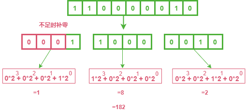
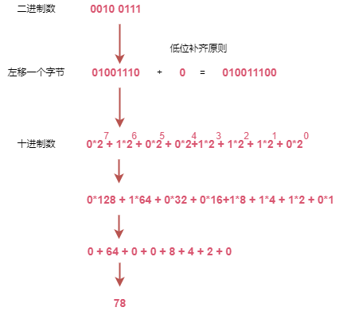
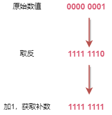
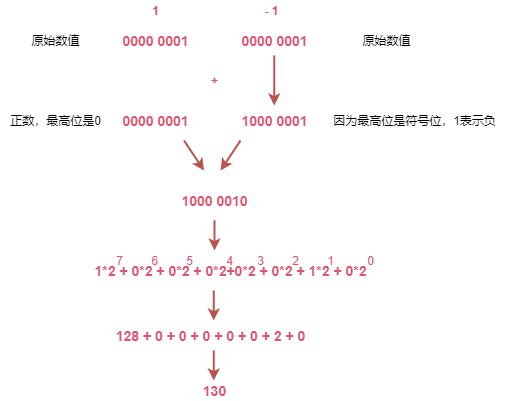
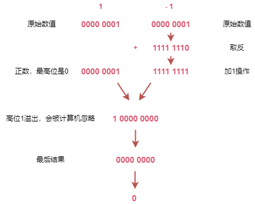
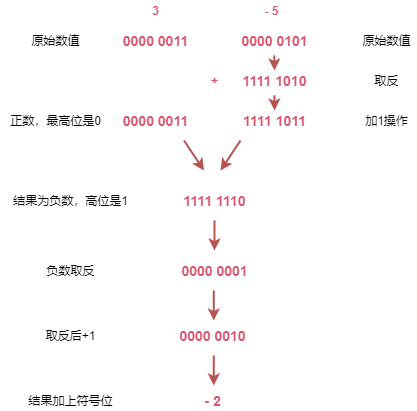

#  Crypto

> 文章作者 [RyuZU](https://github.com/RyuZUSUNC) & [r0fus0d](https://github.com/No-Github)

> 注 : 笔记中拓扑图 drawio 源文件在其图片目录下

---

## 免责声明

`本文档仅供学习和研究使用,请勿使用文中的技术源码用于非法用途,任何人造成的任何负面影响,与本人无关.`

---

# 大纲

* **常见编码**
    * [ASCII](#ascii)
    * [Base](#base)
        * [Base64](#base64)
        * [Base32](#base32)
        * [Base16](#base16)
        * [Base58](#base58)
        * [base92](#base92)
    * [Escape/Unescape](#escapeunescape)
    * [HtmlEncode](#htmlencode)
    * [Punycode](#punycode)
    * [Quoted-printable](#quoted-printable)
    * [shellcode](#shellcode)
    * [Unicode](#unicode)
    * [URL](#url)
    * [UTF](#utf)
    * [UUencode](#uuencode)
    * [XXencode](#xxencode)
    * [进制](#进制)
    * [敲击码](#敲击码)
    * [曼彻斯特编码](#曼彻斯特编码)
    * [图片码](#图片码)
        * [线性条形码](#线性条形码)
        * [二维码](#二维码)
            * [PDF147](#pdf147)
            * [汉信码](#汉信码)

* **哈希 & 摘要 & 散列**
    * [BCrypt](#bcrypt)
    * [MD5](#md5)
    * [RIPEMD](#ripemd)
        * [RIPEMD-160](#ripemd-160)
    * [SHA](#sha)

* **现代加密**
    * [对称性加密算法](#对称性加密算法)
        * [AES](#aes)
        * [DES](#des)
            * [3DES](#3des)
        * [RC4](#rc4)
    * [非对称性加密算法](#非对称性加密算法)
        * [RSA](#rsa)
    * [国密](#国密)
        * [SM1](#sm1)
        * [SM2](#sm2)
        * [SM3](#sm3)
        * [SM4](#sm4)
        * [SM9](#sm9)

* **古典加密**
    * [换位加密](#换位加密)
        * [栅栏密码](#栅栏密码)
        * [曲路密码](#曲路密码)
        * [列移位密码](#列移位密码)
    * [替换加密](#替换加密)
        * [ADFGX](#adfgx)
        * [Bazeries](#bazeries)
        * [Digrafid](#digrafid)
        * [Porta](#porta)
        * [ROT](#rot)
        * [埃特巴什码](#埃特巴什码)
        * [查尔斯加密](#查尔斯加密)
        * [凯撒密码](#凯撒密码)
        * [摩斯电码](#摩斯电码)
        * [简单替换密码](#简单替换密码)
        * [希尔密码](#希尔密码)
        * [波利比奥斯方阵密码](#波利比奥斯方阵密码)
        * [夏多密码](#夏多密码)
        * [普莱菲尔密码](#普莱菲尔密码)
        * [自动密钥密码](#自动密钥密码)
        * [博福特密码](#博福特密码)
        * [滚动密钥密码](#滚动密钥密码)
        * [同音替换密码](#同音替换密码)
        * [仿射密码](#仿射密码)
        * [培根密码](#培根密码)
        * [双密码](#双密码)
        * [三分密码](#三分密码)
        * [四方密码](#四方密码)
        * [棋盘密码](#棋盘密码)
        * [跨棋盘密码](#跨棋盘密码)
        * [分组摩尔斯替换密码](#分组摩尔斯替换密码)
        * [格朗普雷密码](#格朗普雷密码)
        * [比尔密码](#比尔密码)
        * [键盘密码](#键盘密码)
        * [恩尼格玛密码](#恩尼格玛密码)
        * [维吉尼亚密码](#维吉尼亚密码)
        * [猪圈密码](#猪圈密码)

* **其他编码**
    * [Brainfuck](#brainfuck)
    * [JSfuck](#jsfuck)
    * [颜文字加密](#颜文字加密)
    * [与佛论禅](#与佛论禅)
    * [文本加密为汉字](#文本加密为汉字)
    * [随机密码生成](#随机密码生成)
    * [核心价值观加密](#核心价值观加密)

---

**教程资源**
- http://www.practicalcryptography.com/
- https://cryptopals.com/
- https://ctf-wiki.github.io/ctf-wiki/crypto/introduction/
- https://intensecrypto.org/public/

**工具**
- [ffffffff0x/BerylEnigma](https://github.com/ffffffff0x/BerylEnigma) - 一个为渗透测试与CTF而制作的工具集，主要实现一些加解密的功能。
- [gchq/CyberChef](https://github.com/gchq/CyberChef) - 一个用于加密、编码、压缩和数据分析的网络应用
- [Snowming04/Cipher_Encryption_Type_Identification:.](https://github.com/Snowming04/Cipher_Encryption_Type_Identification) - 对密文的加密类型进行判断的命令行工具
- [guyoung/CaptfEncoder](https://github.com/guyoung/CaptfEncoder) - 一款跨平台网络安全工具套件
- [lockedbyte/cryptovenom](https://github.com/lockedbyte/cryptovenom) - 密码学的瑞士军刀
- [Acmesec/CTFCrackTools](https://github.com/Acmesec/CTFCrackTools) - CTF工具框架
- [Ciphey/Ciphey](https://github.com/Ciphey/Ciphey) - 使用自然语言处理和人工智能以及一些全自动解密/解码/破解工具
    ```bash
    python3 -m pip install ciphey --upgrade
    文件输入 ciphey -f encrypted.txt
    不合格输入 ciphey -- "Encrypted input"
    正常方式 ciphey -t "Encrypted input"
    ```
- hash-identifier - kali 自带的 hash 失败工具

**在线工具**
- http://tool.bugku.com/
- http://ctf.ssleye.com/
- https://ctftools.com/down/
- https://gchq.github.io/CyberChef/
- https://www.sojson.com/encrypt/
- https://cryptii.com/

**文章**
- [为什么要在密码里加点"盐" | Libuchao's blog](https://libuchao.com/2013/07/05/password-salt)
- [CTF中那些脑洞大开的编码和加密 - jack_Meng](https://www.cnblogs.com/mq0036/p/6544055.html)
- [How we recovered over $300K of Bitcoin](https://reperiendi.wordpress.com/2020/04/03/how-i-recovered-over-300k-of-bitcoin/)

**CTF writup**
- [IDF实验室-特殊的日子](https://blog.csdn.net/ab748998806/article/details/46382017) - 知识点 : CRC
- [曼切斯特与差分曼切斯特](https://skysec.top/2017/07/10/%E6%9B%BC%E5%88%87%E6%96%AF%E7%89%B9%E4%B8%8E%E5%B7%AE%E5%88%86%E6%9B%BC%E5%88%87%E6%96%AF%E7%89%B9/) - 知识点 : 曼切斯特编码与差分曼切斯特编码
- [BUUCTF平台Crytpo部分Writeup](https://www.anquanke.com/post/id/217151)

---

# 简介

密码学(Cryptography)一般可分为古典密码学和现代密码学.

其中,古典密码学,作为一种实用性艺术存在,其编码和破译通常依赖于设计者和敌手的创造力与技巧,并没有对密码学原件进行清晰的定义.古典密码学主要包含以下几个方面:

- 单表替换加密(Monoalphabetic Cipher)
- 多表替换加密(Polyalphabetic Cipher)
- 奇奇怪怪的加密方式

而现代密码学则起源于 20 世纪中后期出现的大量相关理论,1949 年香农(C. E. Shannon)发表了题为《保密系统的通信理论》的经典论文标志着现代密码学的开始.现代密码学主要包含以下几个方面:

- 对称加密(Symmetric Cryptography),以 DES,AES,RC4 为代表.
- 非对称加密(Asymmetric Cryptography),以 RSA,ElGamal,椭圆曲线加密为代表.
- 哈希函数(Hash Function),以 MD5,SHA-1,SHA-512 等为代表.
- 数字签名(Digital Signature),以 RSA 签名,ElGamal 签名,DSA 签名为代表.

其中,对称加密体制主要分为两种方式:

- 分组密码(Block Cipher),又称为块密码.
- 序列密码(Stream Cipher),又称为流密码.

一般来说,密码设计者的根本目标是保障信息及信息系统的

- 机密性(Confidentiality)
- 完整性(Integrity)
- 可用性(Availability)
- 认证性(Authentication)
- 不可否认性(Non-repudiation)

其中,前三者被称为信息安全的 CIA 三要素 .

而对于密码破解者来说,一般是要想办法识别出密码算法,然后进行暴力破解,或者利用密码体制的漏洞进行破解.当然,也有可能通过构造虚假的哈希值或者数字签名来绕过相应的检测.

攻击类型	|   说明
- | -
唯密文攻击	|   只拥有密文
已知明文攻击 |	拥有密文与对应的明文
选择明文攻击 |	拥有加密权限,能够对明文加密后获得相应密文
选择密文攻击 |	拥有解密权限,能够对密文解密后获得相应明文

---

# 常见编码

`更多内容可以参考` [字符编码](../../Develop/字符编码/字符编码.md#编码)

## ASCII

ASCII 编码大致可以分作三部分组成:

- 第一部分是:ASCII 非打印控制字符;

- 第二部分是:ASCII 打印字符,也就是 CTF 中常用到的转换;

- 第三部分是:扩展 ASCII 打印字符.

编码转换示例

> 源文本: The quick brown fox jumps over the lazy dog

ASCII编码对应十进制:

> 84 104 101 32 113 117 105 99 107 32 98 114 111 119 110 32 102111     120 32 106 117 109 112 115 32 111 118 101 114 32 116104  101 32    108 97 122 121 32 100 111 103

对应可以转换成二进制,八进制,十六进制等.

**在线工具**
- http://www.ab126.com/goju/1711.html

---

## Base
### Base64

base64、base32、base16 可以分别编码转化8位字节为6位、5位、4位.16,32,64 分别表示用多少个字符来编码,这里我注重介绍 base64.Base64 常用于在通常处理文本数据的场合,表示、传输、存储一些二进制数据.包括 MIME 的 email,email via MIME,在 XML 中存储复杂数据.

编码原理:Base64 编码要求把3个8位字节转化为4个6位的字节,之后在6位的前面补两个0,形成8位一个字节的形式,6位2进制能表示的最大数是2的6次方是64,这也是为什么是64个字符(A-Z,a-z,0-9,+,/这64个编码字符,=号不属于编码字符,而是填充字符)的原因,这样就需要一张映射表,如下:


例子(base64):
```
源文本 : T h e
对应 ascii 码 : 84 104 101
8 位 binary : 01010100 01101000 01100101
6 位 binary : 010101 000110 100001 100101
高位补 0 : 000010101 00000110 00100001 00100101
对应 ascii 码 : 21 6 33 37
查表 : V G h l
```

**在线工具**
- http://base64.xpcha.com/
- http://tool.chinaz.com/Tools/Base64.aspx
- https://base64.supfree.net/
- http://www1.tc711.com/tool/BASE64.htm
- http://decodebase64.com/
- http://web.chacuo.net/charsetbase64
- https://www.base64decode.org/

**base64 隐写**
- 相关文章
    - [base64隐写](https://www.jianshu.com/p/48fe4dd3e5ce)
    - [记XDCTF的misc之旅---base64隐写](https://www.cnblogs.com/Pinging/p/7622871.html)

**base64 换表**
- 相关文章
    - [CTF中自定义字符表的Base64编码求解](https://www.freebuf.com/articles/database/256740.html)

---

### base32

**在线工具**
- http://tomeko.net/online_tools/base32.php

---

### base16

**在线工具**
- https://www.qqxiuzi.cn/bianma/base.php?type=16

---

### base58

**相关项目**
- https://github.com/keis/base58

---

### base92

**相关项目**
- https://github.com/thenoviceoof/base92

**在线工具**
- http://ctf.ssleye.com/base92.html

---

## Escape/Unescape

Escape/Unescape 加密解码 / 编码解码, 又叫 %u 编码, 采用 UTF-16BE 模式, Escape 编码 / 加密, 就是字符对应 UTF-16 16 进制表示方式前面加 %u.Unescape 解码 / 解密, 就是去掉 "%u" 后, 将 16 进制字符还原后, 由 utf-16 转码到自己目标字符. 如: 字符 "中",UTF-16BE 是:"6d93", 因此 Escape 是 "%u6d93".

> 源文本: The
>
> 编码后: %u0054%u0068%u0065

---

## HtmlEncode

`HTML实体编码`

HTML 4.01 支持 ISO 8859-1 (Latin-1) 字符集.

ISO-8859-1 的较低部分(从 1 到 127 之间的代码)是最初的 7 比特 ASCII.

ISO-8859-1 的较高部分(从 160 到 255 之间的代码)全都有实体名称.

这些符号中的大多数都可以在不进行实体引用的情况下使用,但是实体名称或实体编号为那些不容易通过键盘键入的符号提供了表达的方法.

注释:实体名称对大小写敏感.

/////[HTML ISO 8859-1 符号实体](https://www.w3school.com.cn/tags/html_ref_entities.html)/////

**带有实体名称的 ASCII 实体**
结果|	描述|	实体名称|	实体编号
|-|-|-|-
`"` |	quotation mark|	`&quot;`|	`&#34;`
`'` |	apostrophe| 	`&apos;`|	`&#39;`
`&` |	ampersand|	`&amp;`|	`&#38;`
`<` |	less-than|	`&lt;`|	`&#60;`
`>` |	greater-than|	`&gt;`|	`&#62;`

**在线工具**
- https://www.qqxiuzi.cn/bianma/zifushiti.php
- http://www.convertstring.com/zh_CN/EncodeDecode/HtmlEncode
- https://tool.oschina.net/encode

---

## Punycode

Punycode 是一种特殊的编码，用于将 Unicode 字符转换为ASCII码，这是一个较小的、受限制的字符集。Punycode 用于编码国际化域名（IDN）。

**相关文章**
- [PunyCode](https://www.jianshu.com/p/5eb5351ca705)

**在线工具**
- https://www.punycoder.com/
- https://myssl.com/punycode.html

---

## Quoted-printable

Quoted-printable 可译为"可打印字符引用编码"、"使用可打印字符的编码",我们收邮件,查看信件原始信息,经常会看到这种类型的编码!

很多时候,我们在邮件头里面能够看到这样的编码

`Content-Transfer-Encoding:quoted-printable`

它是多用途互联网邮件扩展 (MIME) 一种实现方式. 其中 MIME 是一个互联网标准, 它扩展了电子邮件标准, 致力于使其能够支持非 ASCII 字符、二进制格式附件等多种格式的邮件消息.

**编码方法**

任何一个 8 位的字节值可编码为 3 个字符: 一个等号 "=" 后跟随两个十六进制数字 (0-9 或 A-F) 表示该字节的数值. 例如, ASCII 码换页符 (十进制值为 12) 可以表示为 "=0C", 等号 "="(十进制值为 61)必须表示为 "=3D". 除了可打印 ASCII 字符与换行符以外, 所有字符必须表示为这种格式.

所有可打印 ASCII 字符 (十进制值的范围为 33 到 126) 可用 ASCII 字符编码来直接表示, 但是等号 "="(十进制值为 61)不可以这样直接表示. ASCII 的水平制表符 (tab) 与空格符, 十进制为 9 和 32, 如果不出现在行尾则可以用其 ASCII 字符编码直接表示. 如果这两个字符出现在行尾, 必须 QP 编码表示为 "=09″ (tab)或"=20″ (space).

如果数据中包含有意义的行结束标志, 必须转换为 ASCII 回车 (CR) 换行 (LF) 序列, 既不能用原来的 ASCII 字符也不能用 QP 编码的 "=" 转义字符序列. 相反, 如果字节值 13 与 10 有其它的不是行结束的含义, 它们必须 QP 编码为 =0D 与 =0A.

quoted-printable 编码的数据的每行长度不能超过 76 个字符. 为满足此要求又不改变被编码文本, 在 QP 编码结果的每行末尾加上软换行(soft line break). 即在每行末尾加上一个 "=", 但并不会出现在解码得到的文本中.

> 例如:If you believe that truth=beauty, then surely mathematics is the most beautiful branch of philosophy. 编码后结果是
>
> If you believe that truth=3Dbeauty, then surely=20=
mathematics is the most beautiful branch of philosophy.

编码里面,有几个特定限定,一些可打印字符不用编码,当然如果你按照规范编码后,也一样可以显示的!因此自己简单自己实现该编码:

```php
function quoted_printable_encode($string) {
    return preg_replace('/[^\r\n]{73}[^=\r\n]{2}/', "$0=\r\n", str_replace("%","=",
rawurlencode($string)));
}
```

一个函数就可以, 将所有字符串 urlencode 转换后,% 号替换为 "=" 号, 然后对非 \ r\n 超过 73 连续字符, 后面加一个 =\r\n. 这个是简单实现方法. 按照该编码详细说明里面, 有些空格、换行, 还有一些特殊字符可以不用转换. 不过一起转换了, 也不会有影响

**在线工具**
- http://web.chacuo.net/charsetquotedprintable
- http://www.mxcz.net/tools/QuotedPrintable.aspx

---

## shellcode

源文本:

`The quick brown fox jumps over the lazy dog`

编码后:

```
\x54\x68\x65\x7f\x71\x75\x69\x63\x6b\x7f\x62\x72\x6f\x77\x6e\x7f\x66\x6f\x78\x7f\x6a\x75\x6d\x70\x73\x7f\x6f\x76\x65\x72\x7f\x74\x68\x65\x7f\x6c\x61\x7a\x79\x7f\x64\x6f\x67
```

---

## Unicode

Unicode 编码有以下四种编码方式:

> 源文本: The
>
>> &#x [Hex]: &#x0054;&#x0068;&#x0065;
>
>> &# [Decimal]: &#00084;&#00104;&#00101;
>
>> \U [Hex]: \U0054\U0068\U0065
>
>> \U+ [Hex]: \U+0054\U+0068\U+0065

**在线工具**
- http://tool.chinaz.com/tools/unicode.aspx
- http://www.mxcz.net/tools/Unicode.aspx

---

## URL

url 编码又叫百分号编码, 是统一资源定位 (URL) 编码方式. URL 地址 (常说网址) 规定了常用地数字, 字母可以直接使用, 另外一批作为特殊用户字符也可以直接用(/,:@等), 剩下的其它所有字符必须通过 %xx 编码处理. 现在已经成为一种规范了, 基本所有程序语言都有这种编码, 如 js: 有 encodeURI、encodeURIComponent,PHP 有 urlencode、urldecode 等. 编码方法很简单, 在该字节 ascii 码的的 16 进制字符前面加 %. 如 空格字符, ascii 码是 32, 对应 16 进制是'20', 那么 urlencode 编码结果是:%20.

> 源文本:

> The quick brown fox jumps over the lazy dog

> 编码后:

>%54%68%65%20%71%75%69%63%6b%20%62%72%6f%77%6e%20%66%6f%78%20%6a%75%6d%70%73%20%6f%76%65%72%20%74%68%65%20%6c%61%7a%79%20%64%6f%67

**在线工具**
- http://web.chacuo.net/charseturlencode
- https://meyerweb.com/eric/tools/dencoder/
- http://tool.oschina.net/encode?type=4
- http://www.mxcz.net/tools/Url.aspx

---

## UTF

**在线工具**
- http://tool.chinaz.com/Tools/UTF-8.aspx
- http://tool.oschina.net/encode?type=2

---

## UUencode

UUencode 是一种二进制到文字的编码, 最早在 unix 邮件系统中使用, 全称: Unix-to-Unix encoding,UUencode 将输入文本以每三个字节为单位进行编码, 如果最后剩下的资料少于三个字节, 不够的部份用零补齐. 三个字节共有 24 个 Bit, 以 6-bit 为单位分为 4 个组, 每个组以十进制来表示所出现的字节的数值. 这个数值只会落在 0 到 63 之间. 然后将每个数加上 32, 所产生的结果刚好落在 ASCII 字符集中可打印字符 (32 - 空白… 95 - 底线) 的范围之中.

> 源文本: The quick brown fox jumps over the lazy dog

> 编码后: `M5&AE('%U:6-K(&)R;W=N(&9O>"!J=6UP<R!O=F5R('1H92!L87IY(&1O9PH*`

**在线工具**
- http://web.chacuo.net/charsetuuencode
- http://www.mxcz.net/tools/UUEncode.aspx

---

## XXencode

XXencode 将输入文本以每三个字节为单位进行编码. 如果最后剩下的资料少于三个字节, 不够的部份用零补齐. 这三个字节共有 24 个 Bit, 以 6bit 为单位分为 4 个组, 每个组以十进制来表示所出现的数值只会落在 0 到 63 之间. 以所对应值的位置字符代替. 它所选择的可打印字符是`+-0123456789ABCDEFGHIJKLMNOPQRSTUVWXYZabcdefghijklmnopqrstuvwxyz`, 一共 64 个字符. 跟 base64 打印字符相比, 就是 UUencode 多一个 "-" 字符, 少一个 "/" 字符.


> 源文本:
> The quick brown fox jumps over the lazy dog\
> 编码后:
> hJ4VZ653pOKBf647mPrRi64NjS0-eRKpkQm-jRaJm65FcNG-gMLdt64FjNkc+

**在线工具**
- http://web.chacuo.net/charsetxxencode

---

## 进制

进制是一种逢几进一的运算。

N 进制就是逢 N 进 1，最小值为 0，最大值为 N-1

例如，十六进制和二进制和十进制的关系

| 十六进制 | 二进制 | 十进制 | 八进制
| -------- | ------ | ----- | ----- |
| 0        | 0000   | 0     | 0
| 1        | 0001   | 1     | 1
| 2        | 0010   | 2     | 2
| 3        | 0011   | 3     | 3
| 4        | 0100   | 4     | 4
| 5        | 0101   | 5     | 5
| 6        | 0110   | 6     | 6
| 7        | 0111   | 7     | 7
| 8        | 1000   | 8     | 10
| 9        | 1001   | 9     | 11
| A        | 1010   | 10    | 12
| B        | 1011   | 11    | 13
| C        | 1100   | 12    | 14
| D        | 1101   | 13    | 15
| E        | 1110   | 14    | 16
| F        | 1111   | 15    | 17

**缩写**
- 二进制 - B、BIN
- 八进制 - O、OCT
- 十进制 - D、DEC
- 十六进制 - H、HEX、0x

**转换**
- 十进制转二进制

    十进制数除 2 取余法，即十进制数除 2，余数为权位上的数，得到的商值继续除。

    

- 二进制转十进制

    把二进制数按权展开、相加即得十进制数，其实就是讲每位的二进制数 1 或者 0 乘以 2 的 n 次方

    

- 二进制转十六进制

    4 位二进制数按权展开相加得到 1 位十六进制数。(4 位二进制数转成十六进制是从右到左开始转化，不足时补 0)

    

**移位**

以 39 位例，将十进制的 39 转为二进制的 0010 0111，然后向左移位 << 一个字节，变成 0100 1110 ，再转为十进制为 78，此时如果再让 0010 0111 左移两位，变为 1001 1100 ，得出来就是 156，相当于扩大 4 倍。



**补数**

如果将数右移，那么空出来的高数值如何处理？

计算机中没有负数，那么做减法就是在做加法，用加法实现减法的运算，例如 100-50 计算机看来是 100+(-50)，为此，表示负数就要用到二进制补数 (补码)，补数用正数表示负数。

补码就是将原数反码再加 1.



补数的获取，逻辑上非常严谨，以 1-1 为例，举个错误例子



1-1 的结果为 130，而不是 0，可以得出结论 1000 0001 表示 -1 是错误的。

以正确结果看,1-1其实就是 1+(-1) ,对 -1 进行上面的取反+1后变为 1111 1111，然后与1进行加法运算，得到九位的 1 0000 0000，结果发送了溢出，计算机会直接忽略掉溢出位，变为 0000 0000，所以 1111 1111 表示 -1



所以负数的二进制表示就是先求其补数，补数的求解过程就是对原始数值的二进制取反 + 1.

结果不为 0 的运算同样可以通过补数得到正确的结果，当结果为负时，计算结果的值也是以补数的形式存在的。例如 3-5，如下



编程语言的数据类型中，有的可以处理负数，有的不可以，比如 C 语言中不能处理负数的 unsigned short 类型，也有能处理负数的 short 类型，都是 2 个字节的变量，它们都有 2 的十六次幂种值，但取值范围不同，short 类型的取值范围为 -32768~32767，unsigned short 的取值范围是 0~65535.

思考一下补数的机制就知道为什么 - 32768 比 32767 多一个数的原因，最高位是 0 的正数有 0~32767 共 32768 个，包括 0，最高位是 1 的负数有 - 1~-32768 共 32768 个，不含 0，0 不是正数也不是负数，但考虑到符号位，归类为正数。

**在线工具**
- https://js.tuisec.win/convert/ox2str/
- http://www.convertstring.com/zh_CN/EncodeDecode/HexDecode
- http://tool.oschina.net/hexconvert/
- http://www.mxcz.net/tools/Hex.aspx
- https://www.bejson.com/convert/ox2str/
- https://www.sojson.com/hexadecimal.html

---

## 敲击码

敲击码 (Tap code) 是一种以非常简单的方式对文本信息进行编码的方法. 因该编码对信息通过使用一系列的点击声音来编码而命名, 敲击码是基于 5×5 方格波利比奥斯方阵来实现的, 不同点是是用 K 字母被整合到 C 中.

敲击码表:


---

## 曼彻斯特编码

在电信与数据存储中, 曼彻斯特编码 (Manchester coding), 又称自同步码、相位编码 (phase encoding,PE), 能够用信号的变化来保持发送设备和接收设备之间的同步.

它用电压的变化来分辨 0 和 1, 从高电平到低电平的跳变代表 1, 而从低电平到高电平的跳变代表 0(as per G.E.Tomas 编码方式). 从高电平到低电平的跳变代表 0, 而从低电平到高电平的跳变代表 1(as per IEEE 802.3 编码方式)

信号的保持不会超过一个比特位的时间间隔. 即使是 0 或 1 的序列, 信号也将在每个时间间隔的中间发生跳变. 这种跳变将允许接收设备的时钟与发送设备的时钟保持一致.

曼彻斯特编码被物理层用来编码一个同步位流的时钟和数据. 因此, 曼彻斯特编码被用在以太网媒介系统中.

曼彻斯特编码提供一个简单的方式给编码简单的二进制序列而没有长的周期及转换级别, 因而防止时钟同步的丢失, 或来自低频率位移在贫乏补偿的模拟链接位错误.

在这个技术下, 实际上的二进制数据被传输通过这个电缆, 不是作为一个序列的逻辑 1 或 0 来发送的 (NRZ). 与 NRZ 相反, 这些位被转换为一个稍微不同的格式, 它通过使用直接的二进制编码.

曼彻斯特编码还被用于局域网传输.

- 优点

    与 NRZ 相比,曼彻斯特编码提供一种同步机制,保证发送端与接收端信号同步.

- 缺点

    曼彻斯特编码的频率要比NRZ高一倍,传输等量数据所需的带宽大一倍


(根据802.3中规定编码方式)从接收的编码位中提取原始数据:

<table style="text-align:center;">
<tr><th>原始数据</th><th></th><th>时钟</th><th></th><th>曼彻斯特值</th></tr><tr><td rowspan="2">0</td><td rowspan="4">=</td><td>0</td><td rowspan="4">XOR <br />⊕</td><td>0</td></tr><tr><td>1</td><td>1</td></tr><tr><td rowspan="2">1</td><td>0</td><td>1</td></tr><tr><td>1</td><td>0</td></tr></table>

总结:

- 每个比特发送时间恒定("周期").
- 0用低至高转换表示,1用高到低转换表示(根据G.E. Thomas方式—IEEE 802.3方式与之相反).
- 表示0或1的转换出现在周期的中点.
- 周期开始的转换不表示数据.

**相关文章**
- [曼彻斯特编码](https://zh.wikipedia.org/wiki/%E6%9B%BC%E5%BD%BB%E6%96%AF%E7%89%B9%E7%BC%96%E7%A0%81)

---

## 图片码

条形码或称条码（barcode）是将宽度不等的多个黑条和空白，按照一定的编码规则排列，用以表达一组信息的图形标识符。常见的条形码是由反射率相差很大的黑条（简称条）和白条（简称空）排成的平行线图案。条形码可以标出物品的生产国、制造厂家、商品名称、生产日期、图书分类号、邮件起止地点、类别、日期等信息，因而在商品流通、图书管理、邮政管理、银行系统等许多领域都得到了广泛的应用。

要将按照一定规则编译出来的条形码转换成有意义的信息，需要经历扫描和译码两个过程。物体的颜色是由其反射光的类型决定的，白色物体能反射各种波长的可见光，黑色物体则吸收各种波长的可见光，所以当条形码扫描器光源发出的光在条形码上反射后，反射光照射到条码扫描器内部的光电转换器上，光电转换器根据强弱不同的反射光信号，转换成相应的电信号。根据原理的差异，扫描器可以分为光笔、CCD、激光三种。电信号输出到条码扫描器的放大电路增强信号之后，再送到整形电路将模拟信号转换成数字信号。白条、黑条的宽度不同，相应的电信号持续时间长短也不同。然后译码器通过测量脉冲数字电信号0、1的数目来判别条和空的数目，通过测量0、1信号持续的时间来判别条和空的宽度。此时所得到的数据仍然是杂乱无章的，要知道条形码所包含的信息，则需根据对应的编码规则（例如：EAN-8码），将条形符号换成相应的数字、字符信息。最后，由计算机系统进行数据处理与管理，物品的详细信息便被识别了。

### 线性条形码

第一代，“一维”的条码是由线条和空间的各种宽度，创建特定的模式。

**相关工具**
- [免费在线条码生成器](https://barcode.tec-it.com/zh)

---

### 二维码

**在线制作/识别二维码工具**
- http://tool.chinaz.com/qrcode/
- http://jiema.wwei.cn/
- https://cli.im/
- https://www.beaconstac.com/qr-code-generator

**二维码分析与恢复工具包**
- [Merricx/qrazybox](https://github.com/Merricx/qrazybox)
    - 在线使用 : https://merricx.github.io/qrazybox/

#### PDF147

PDF417条码是二维码的一种。由台湾赴美王寅君（Wang, Ynjiun P.）博士于1992年底在美国符号科技公司（Symbol Technologies, Inc.）发明。现收录入ISO 15438国际标准。

PDF417条码是一种高密度、高信息含量的便携式数据文件，是实现证件及卡片等大容量、高可靠性信息自动存储、携带并可用机器自动识读的理想手段。可以用传统的线性扫码器（linear scanner）识别；而二维码需要图像传感器成像才能识别。

PDF417编码 由3到90行组成，每一行都类似于小的线性编码，并有如下内容：
- 分割区：这个区域包含了编码开始前的空格
- [起始标识]PDF417起始识别编码
- [数据左标]本行的设定信息（如行号，纠错等级）
- [数据]1到30个数据码字：码字是一组代表一个或多个字符的小黑条和空格
- [数据右标]包含本行的其他信息
- [结束标识]
- 分割区（quiet zone）：在条码上下左右都要有空白区域。

每行都是同样的宽度，每行都有同样数量的码字。每个PDF417的码字（code word）的长度都为17个单位，包含了长度不等的4个黑色区域（bar）与4个白色区域（space），单个区域的长度不得超过6个单位。故得名417。标准规定，宽度单位的下限为0.0075英寸（约0.191毫米）。每个码字基于929编码，即码值为0-928。每个码字以bar开始，以space结束。有三套不同的码字编码，称作clusters，分别标记为0，3，6。各行依次采用一套cluster，依次循环，即：第1行使用cluster 0， 第2行使用cluster 3， 第3行使用cluster 6， 第4行又使用cluster 0，依次类推。

**在线工具**
- [ZXing Decoder Online](https://zxing.org/w/decode.jspx)
- [Free Online Barcode Generator](https://www.barcodesinc.com/generator/index.php?redirect=welcome-raco-customers)

---

#### 汉信码

汉信码是一种矩阵式二维条码。从形状上，它呈正方向、有深色和浅色数据模块分布其间。汉信码的研发始于2003年，并于2005年年末完成。

**在线识别汉信码工具**
- http://www.efittech.com/hxdec.html

---

# 哈希&摘要&散列

Hash，一般翻译做散列、杂凑，或音译为哈希，是把任意长度的输入（又叫做预映射pre-image）通过散列算法变换成固定长度的输出，该输出就是散列值。这种转换是一种压缩映射，也就是，散列值的空间通常远小于输入的空间，不同的输入可能会散列成相同的输出，所以不可能从散列值来确定唯一的输入值。简单的说就是一种将任意长度的消息压缩到某一固定长度的消息摘要的函数。

将数据（如一段文字）运算变为另一固定长度值，是散列算法的基础原理。

### BCrypt

Bcrypt 是一种跨平台的文件加密工具。Bcrypt 使用的是布鲁斯 · 施内尔在 1993 年发布的 Blowfish 加密算法。由它加密的文件可在所有支持的操作系统和处理器上进行转移。它的口令必须是 8 至 56 个字符，并将在内部被转化为 448 位的密钥。

Bcrypt 就是一款加密工具，可以比较方便地实现数据的加密工作。你也可以简单理解为它内部自己实现了随机加盐处理。使用 Bcrypt，每次加密后的密文是不一样的。

对一个密码，Bcrypt 每次生成的 hash 都不一样，那么它是如何进行校验的？

虽然对同一个密码，每次生成的 hash 不一样，但是 hash 中包含了 salt（hash 产生过程：先随机生成 salt，salt 跟 password 进行 hash）；

在下次校验时，从 hash 中取出 salt，salt 跟 password 进行 hash；得到的结果跟保存在 DB 中的 hash 进行比对。

BCrypt 算法将 salt 随机并混入最终加密后的密码，验证时也无需单独提供之前的 salt，从而无需单独处理 salt 问题。

加密后的格式一般为：
```
$2a$10$/bTVvqqlH9UiE0ZJZ7N2Me3RIgUCdgMheyTgV0B4cMCSokPa.6oCa
其中：$ 是分割符，无意义；2a 是 bcrypt 加密版本号；10 是 cost 的值；而后的前 22 位是 salt 值；再然后的字符串就是密码的密文了。
```

**相关文章**
- [算法高级（22）-BCrypt加密算法，号称目前最安全的算法之一](https://blog.csdn.net/m0_37609579/article/details/100785947)

**在线工具**
- https://bcrypt-generator.com/

### MD5

MD5消息摘要算法（英语：MD5 Message-Digest Algorithm），一种被广泛使用的密码散列函数，可以产生出一个128位（16字节）的散列值（hash value），用于确保信息传输完整一致。MD5由美国密码学家罗纳德·李维斯特（Ronald Linn Rivest）设计，于1992年公开，用以取代MD4算法。这套算法的程序在 RFC 1321 中被加以规范。

一般128位的MD5散列被表示为32位十六进制数字。以下是一个43位长的仅ASCII字母列的MD5散列：
```
MD5("The quick brown fox jumps over the lazy dog")= 9e107d9d372bb6826bd81d3542a419d6
```

即使在原文中作一个小变化（比如用 c 取代 d）其散列也会发生巨大的变化：
```
MD5("The quick brown fox jumps over the lazy cog")= 1055d3e698d289f2af8663725127bd4b
```
空文的散列为：
```
MD5("")= d41d8cd98f00b204e9800998ecf8427e
```

**相关文章**
- [MD5](https://zh.wikipedia.org/wiki/MD5#cite_note-1)
- [md5(unix)原理分析](https://www.leavesongs.com/PENETRATION/about-hash-password.html)
- [一个文件变出六种格式？它比"格式工厂"厉害多了](https://www.pingwest.com/a/185806)
- [MD5碰撞的一些例子](https://www.jianshu.com/p/c9089fd5b1ba)

**在线工具**
- https://md5.navisec.it/
- https://www.somd5.com/
- https://www.somd5.com/batch.html
- https://www.md5online.org/
- http://md5.tellyou.top/
- http://www.cmd5.com/
- http://hashcrack.com/
- https://md5.gromweb.com/
- http://tool.chinaz.com/Tools/MD5.aspx
- https://cmd5.la/
- http://pmd5.com/
- http://www.ttmd5.com/
- http://www.xmd5.org/
- https://crackstation.net/
- http://www.md5this.com/index.php
- https://md5online.org/
- http://md5.my-addr.com/md5_decrypt-md5_cracker_online/md5_decoder_tool.php
- https://md5.la/
- https://md5.cc/
- https://pmd5.com/

**相关工具**
```
md5sum xxx.txt
```

---

### RIPEMD

RIPEMD (RACE 原始完整性校验讯息摘要)是一种加密哈希函数，发布于1996年。 RIPEMD 是以 MD4 为基础原则所设计的 ，而且其表现与更有名的 SHA-1 类似.

同时也存在着128,256-320位元的这种算法，称为 RIPEMD-128,RIPEMD-256 和 RIPEMD-320。

128位版本的用意仅是取代原始版 RIPEMD，因为原版也同样是128位元，并且被发现有潜在的安全问题。

而256和320位版本只有减少碰撞发生的机率，但没有提升安全等级(以 preimage 举例)。不过，RIPEMD 的设计者们没有真正设计256和320位元这2种标准，他们只是在128位元和160位元的基础上，修改了初始参数和 s-box 来达到输出为256和320位元。所以，256位的强度和128相当，而320位的强度和160位相当。且 RIPEMD 建立在 md 的基础之上，所以其添加数据的方式和 md5 完全一样。

#### RIPEMD-160

RIPEMD-160 是以原始版 RIPEMD 所改进的 160 位元版本，而且是 RIPEMD 系列中最常见的版本。 RIPEMD-160 是设计给学术社群所使用的，刚好相对于 NSA 所设计 SHA-1 和 SHA-2 算法。 另一方面，RIPEMD-160 比 SHA-1 较少使用，所以可能造成 RIPEMD-160 比 SHA 还不常被审查。另外，RIPEMD-160 并没有任何专利所限制。

160位元的 RIPEMD-160 哈希值是以40位的十六进制所表示。 下面表明了43字节 ASCII 码的输入与其对应的 RIPEMD-160 哈希值：
```
RIPEMD-160("The quick brown fox jumps over the lazy dog") = 37f332f68db77bd9d7edd4969571ad671cf9dd3b
```

RIPEMD-160 能表现出理想的 雪崩效应 (例如将 d 改成 c，即微小的变化就能产生一个完全不同的哈希值):
```
RIPEMD-160("The quick brown fox jumps over the lazy cog") = 132072df690933835eb8b6ad0b77e7b6f14acad7
```

0字串长度的哈希值表示为：
```
RIPEMD-160("") = 9c1185a5c5e9fc54612808977ee8f548b2258d31
```

**相关文章**
- [RIPEMD](https://zh.wikipedia.org/wiki/RIPEMD)

**在线工具**
- http://www.convertstring.com/zh_CN/Hash/RIPE_MD160

---

### SHA

**SHA1 碰撞**
- [SHAttered](https://shattered.io/)
- [SHA1 collider](https://alf.nu/SHA1)

**在线工具**
- [SHA1哈希 - 在线SHA1散列发生器](http://www.convertstring.com/zh_CN/Hash/SHA1)
- [SHA256哈希 - 在线SHA256哈希发生器](http://www.convertstring.com/zh_CN/Hash/SHA256)
- [SHA384哈希 - 在线SHA384哈希发生器](http://www.convertstring.com/zh_CN/Hash/SHA384)
- [SHA512哈希 - 在线SHA512哈希发生器](http://www.convertstring.com/zh_CN/Hash/SHA512)

---

# 现代密码

**文章**
- [安全体系(一)—— DES算法详解](https://www.cnblogs.com/songwenlong/p/5944139.html)
- [安全体系(零)—— 加解密算法、消息摘要、消息认证技术、数字签名与公钥证书](http://www.cnblogs.com/songwenlong/p/6517165.html)
- [Blowfish (密码学) - 维基百科,自由的百科全书](https://zh.wikipedia.org/wiki/Blowfish_(%E5%AF%86%E7%A0%81%E5%AD%A6))
- [朝鲜红星操作系统加密算法解析](http://www.4hou.com/technology/12487.html)
- [这些hash你了解吗？](http://www.myh0st.cn/index.php/archives/304/)

**在线工具**
- http://www.mxcz.net/tools/MD5.aspx
- http://tool.oschina.net/encrypt/
- http://encode.chahuo.com/
- http://tool.chacuo.net/cryptdes
- https://hashtoolkit.com/

---

## 对称性加密算法

对称密钥算法（英语：Symmetric-key algorithm）又称为对称加密、私钥加密、共享密钥加密，是密码学中的一类加密算法。这类算法在加密和解密时使用相同的密钥，或是使用两个可以简单地相互推算的密钥。事实上，这组密钥成为在两个或多个成员间的共同秘密，以便维持专属的通信联系。与公开密钥加密相比，要求双方获取相同的密钥是对称密钥加密的主要缺点之一。

对称加密的速度比公钥加密快很多，在很多场合都需要对称加密。

### AES

高级加密标准（英语：Advanced Encryption Standard，缩写：AES），在密码学中又称Rijndael加密法，是美国联邦政府采用的一种区块加密标准。这个标准用来替代原先的DES，已经被多方分析且广为全世界所使用。经过五年的甄选流程，高级加密标准由美国国家标准与技术研究院（NIST）于2001年11月26日发布于FIPS PUB 197，并在2002年5月26日成为有效的标准。现在，高级加密标准已然成为对称密钥加密中最流行的算法之一。

AES 加密的模式主要有五种：ECB (电子密码本模式)、CBC（密码分组连接模式）、CTR（计算器模式）、CFB（密码反馈模式）、OFB (输出反馈模式)。这五种工作模式主要是在加密器的使用上有所区别。

**ECB 模式**

其使用方式是一个明文分组加密成一个密文分组，相同的明文分组永远被加密成相同的密文分组。直接利用加密算法分别对每个 64 位明文分组使用相同的 64 位密钥进行加密。每个明文分组的处理是相互独立的。

- 优点：
    - 简单。
    - 有利于并行计算。

- 缺点：
    - 相同的明文块会加密成相同的密文块，安全性低。

**CBC 模式**

引入一个初始向量 IV，它的作用跟 MD5 加盐有些类似，可以防止相同的明文块加密成同样的密文块。IV 是初始向量，参与第一个明文块的异或，后续的每一个明文块，都与它前一个密文块相异或。这样就能保证相同的明文块不会被加密为相同的密文块。

- 优点：能隐蔽明文的数据模式，在某种程度上能防止数据篡改, 诸如明文组的重放,嵌入和删除等，安全性高。
- 缺点：无法并行计算，性能相对 ECB 低，会出现错误传播(errorpropagation)。

**在线工具**
- [AES Encryption  Easily encrypt or decrypt strings or files](http://aes.online-domain-tools.com/)
- [在线AES加密解密、AES在线加密解密、AES encryption and decryption--查错网](http://tool.chacuo.net/cryptaes)

---

### DES

数据加密标准（英语：Data Encryption Standard，缩写为 DES）是一种对称密钥加密块密码算法，1976年被美国联邦政府的国家标准局确定为联邦资料处理标准（FIPS），随后在国际上广泛流传开来。它基于使用56位密钥的对称算法。这个算法因为包含一些机密设计元素，相对短的密钥长度以及怀疑内含美国国家安全局（NSA）的后门而在开始时有争议，DES因此受到了强烈的学院派式的审查，并以此推动了现代的块密码及其密码分析的发展。

在某些文献中，作为算法的DES被称为DEA（Data Encryption Algorithm，数据加密算法），以与作为标准的DES区分开来。

**在线工具**
- [DES加密、DES解密 - 在线工具](https://oktools.net/des)
- [CTF在线工具-DES在线加解密|DES在线加密|DES在线解密|DES encryption|DES decryption](http://ctf.ssleye.com/cdes.html)

---

#### 3DES

密码学中，三重数据加密算法（英语：Triple Data Encryption Algorithm，缩写为TDEA，Triple DEA），或称3DES（Triple DES），是一种对称密钥加密块密码，相当于是对每个数据块应用三次资料加密标准（DES）算法。由于计算机运算能力的增强，原版DES由于密钥长度过低容易被暴力破解；3DES即是设计用来提供一种相对简单的方法，即通过增加DES的密钥长度来避免类似的攻击，而不是设计一种全新的块密码算法。

---

### RC4

在密码学中，RC4（来自Rivest Cipher 4的缩写）是一种流加密算法，密钥长度可变。它加解密使用相同的密钥，因此也属于对称加密算法。RC4是有线等效加密（WEP）中采用的加密算法，也曾经是TLS可采用的算法之一。

由美国密码学家罗纳德·李维斯特（Ronald Rivest）在1987年设计的。由于RC4算法存在弱点，2015年2月所发布的 RFC 7465 规定禁止在TLS中使用RC4加密算法。

RC4由伪随机数生成器和异或运算组成。RC4的密钥长度可变，范围是[1,255]。RC4一个字节一个字节地加解密。给定一个密钥，伪随机数生成器接受密钥并产生一个S盒。S盒用来加密数据，而且在加密过程中S盒会变化。

由于异或运算的对合性，RC4加密解密使用同一套算法。

**相关文章**
- [RC4](https://zh.wikipedia.org/wiki/RC4)

**在线工具**
- https://www.sojson.com/encrypt_rc4.html
- http://tool.chacuo.net/cryptrc4

---

## 非对称性加密算法

公开密钥密码学（英语：Public-key cryptography）也称非对称式密码学（英语：Asymmetric cryptography）是密码学的一种算法，它需要两个密钥，一个是公开密钥，另一个是私有密钥；公钥用作加密，私钥则用作解密。使用公钥把明文加密后所得的密文，只能用相对应的私钥才能解密并得到原本的明文，最初用来加密的公钥不能用作解密。由于加密和解密需要两个不同的密钥，故被称为非对称加密；不同于加密和解密都使用同一个密钥的对称加密。公钥可以公开，可任意向外发布；私钥不可以公开，必须由用户自行严格秘密保管，绝不透过任何途径向任何人提供，也不会透露给被信任的要通信的另一方。

基于公开密钥加密的特性，它还能提供数字签名的功能，使电子文件可以得到如同在纸本文件上亲笔签署的效果。

公开密钥基础建设透过信任数字证书认证机构的根证书、及其使用公开密钥加密作数字签名核发的公开密钥认证，形成信任链架构，已在TLS实现并在万维网的HTTP以HTTPS、在电子邮件的SMTP以SMTPS或STARTTLS引入。

另一方面，信任网络则采用去中心化的概念，取代了依赖数字证书认证机构的公钥基础设施，因为每一张电子证书在信任链中最终只由一个根证书授权信任，信任网络的公钥则可以累积多个用户的信任。PGP就是其中一个例子。

### RSA

RSA加密算法是一种非对称加密算法，在公开密钥加密和电子商业中被广泛使用。RSA是由罗纳德·李维斯特（Ron Rivest）、阿迪·萨莫尔（Adi Shamir）和伦纳德·阿德曼（Leonard Adleman）在1977年一起提出的。

**相关文章**
- [RSA算法原理(一)](http://www.ruanyifeng.com/blog/2013/06/rsa_algorithm_part_one.html)
- [RSA算法原理(二)](http://www.ruanyifeng.com/blog/2013/07/rsa_algorithm_part_two.html)
- [RSA史上最强剖析,从小白变大神,附常用工具使用方法及CTF中RSA典型例题](http://www.freebuf.com/sectool/163781.html)
- [扩展欧几里得算法](https://zh.wikipedia.org/wiki/%E6%89%A9%E5%B1%95%E6%AC%A7%E5%87%A0%E9%87%8C%E5%BE%97%E7%AE%97%E6%B3%95)

---

## 国密

国密即国家密码局认定的国产密码算法。主要有SM1，SM2，SM3，SM4。密钥长度和分组长度均为128位。

**相关工具**
- [tjfoc/gmsm: GM SM2/3/4 library based on Golang (基于Go语言的国密SM2/SM3/SM4算法库)](https://github.com/tjfoc/gmsm)
- [JuneAndGreen/sm-crypto: 国密算法js版](https://github.com/JuneAndGreen/sm-crypto)
- [PopezLotado/SM2Java: 国密SM2,SM3 Java实现](https://github.com/PopezLotado/SM2Java)
- [NEWPLAN/SMx: 国家商用加密算法 SMx(SM2,SM3,SM4)](https://github.com/NEWPLAN/SMx) - C 的实现
- [algorithmNation:国密算法 SM2加解密 SM2 SM3 SM4签名验签](https://gitee.com/xshuai/algorithmNation)
- [ZZMarquis/gmhelper:基于BC库:国密SM2/SM3/SM4算法简单封装;实现SM2 X509v3证书的签发;实现SM2 pfx证书的签发 ](https://github.com/ZZMarquis/gmhelper)
- [gotoworld/hsd-cipher-sm](https://github.com/gotoworld/hsd-cipher-sm) - JAVA 国产密码算法 SM2，SM3，SM4 实现

### SM1

SM1 为对称加密.其加密强度与 AES 相当.该算法不公开,调用该算法时,需要通过加密芯片的接口进行调用.

---

### SM2

SM2 为非对称加密,基于 ECC.该算法已公开.由于该算法基于ECC,故其签名速度与秘钥生成速度都快于 RSA.ECC 256位(SM2 采用的就是 ECC 256 位的一种)安全强度比 RSA 2048 位高,但运算速度快于 RSA.

---

### SM3

国密即国家密码局认定的国产密码算法.主要有 SM1,SM2,SM3,SM4.密钥长度和分组长度均为 128 位.

SM3 消息摘要.可以用 MD5 作为对比理解.该算法已公开.校验结果为256位.

---

### SM4

SM4 无线局域网标准的分组数据算法.对称加密,密钥长度和分组长度均为128位.

---

### SM9

在商用密码体系中，SM9主要用于用户的身份认证。据新华网公开报道，SM9 的加密强度等同于3072位密钥的 RSA 加密算法.

SM9主要包括三部分：签名算法、密钥交换算法、加密算法，其中SM9签名算法收录于ISO/IEC 14888-3:2018《信息安全技术带附录的数字签名第3部分：基于离散对数的机制》。

---

# 古典密码

**文章**
- [Leet - 维基百科,自由的百科全书](https://zh.wikipedia.org/wiki/Leet)
- [纳瓦霍密码](https://baike.baidu.com/item/%E7%BA%B3%E7%93%A6%E9%9C%8D%E5%AF%86%E7%A0%81/9482868)

**语义分析**
- https://quipqiup.com/

---

## 换位加密
### 栅栏密码

栅栏密码(Rail-fence Cipher)就是把要加密的明文分成N个一组,然后把每组的第1个字符组合,每组第2个字符组合...每组的第N(最后一个分组可能不足N个)个字符组合,最后把他们全部连接起来就是密文,这里以2栏栅栏加密为例.

- 明文: The quick brown fox jumps over the lazy dog

- 去空格: Thequickbrownfoxjumpsoverthelazydog

- 分组: Th eq ui ck br ow nf ox ju mp so ve rt he la zy do g

- 第一组: Teucbonojmsvrhlzdg

- 第二组: hqikrwfxupoeteayo

- 密文: Teucbonojmsvrhlzdghqikrwfxupoeteayo

**文章**
- [Practical Cryptography](http://www.practicalcryptography.com/ciphers/classical-era/rail-fence/)

---

### 曲路密码

曲路密码(Curve Cipher)是一种换位密码,需要事先双方约定密钥(也就是曲路路径).

> 明文: The quick brown fox jumps over the lazy dog

填入5行7列表(事先约定填充的行列数)


加密的回路线(事先约定填充的行列数)


> 密文: gesfc inpho dtmwu qoury zejre hbxva lookT

---

### 列移位密码

列移位密码(Columnar Transposition Cipher)是一种比较简单,易于实现的换位密码,通过一个简单的规则将明文打乱混合成密文.

> 以明文 The quick brown fox jumps over the lazy dog,密钥 how are u为例:

填入5行7列表(事先约定填充的行列数,如果明文不能填充完表格可以约定使用某个字母进行填充)


密钥: how are u

按how are u在字母表中的出现的先后顺序进行编号,我们就有a为1,e为2,h为3,o为4,r为5,u为6,w为7,所以先写出a列,其次e列,以此类推写出的结果便是密文:


> 密文: qoury inpho Tkool hbxva uwmtd cfseg erjez

另外由列移位密码变化来的密码也有其他的,比如 Amsco密码 (Amsco Cipher)和 Cadenus密码 (Cadenus Cipher).

## 替换加密
### ADFGX

**ADFGX 密码**

ADFGX 密码(`ADFGX Cipher`)是结合了改良过的 Polybius 方格替代密码与单行换位密码的矩阵加密密码,使用了 5 个合理的密文字母:A,D,F,G,X,这些字母之所以这样选择是因为当转译成摩尔斯电码(ADFGX 密码是德国军队在一战发明使用的密码)不易混淆,目的是尽可能减少转译过程的操作错误.

加密矩阵:


> 明文: THE QUICK BROWN FOX
>
>> 矩阵加密:XF AD DA   AF XD XG GA FG   XA FX DX GX DG   FA DX FF
>>
>> 列移位密钥: how are u
>>
>> 
>
> 密文: DXADF AGXF XFFXD FXGGX DGFG AADA ADXXF

**ADFGVX 密码**

ADFGVX 密码实际上就是 ADFGX 密码的扩充升级版,一样具有 ADFGX 密码相同的特点,加密过程也类似,不同的是密文字母增加了 V,使得可以再使用 10 数字来替换明文.


加密过程完全类似

**在线工具**
- http://www.practicalcryptography.com/ciphers/adfgx-cipher/

---

### Bazeries

Bazeries 密码是换位密码和替换密码的组合,使用两个波利比奥斯方阵,一个明文字母方阵,使用一个随机的数字(一般小于1000000)的生成一个密钥矩阵同时作为第一轮明文划分分组,比如2333这个数字翻译为英文便是 TWO THOUSAND THREE HUNDRED THIRTY THREE,从第一个字母 T 开始选取不重复的字母,之后再从字母表中按序选取没有出现的字母组成密钥矩阵.

明文: `THE QUICK BROWN FOX JUMPS OVER THE LAZY DOG`

随机数字: 2333

明文矩阵:
```
    #!shell
    A  F  L  Q  V
    B  G  M  R  W
    C  H  N  S  X
    D I/J O  T  Y
    E  K  P  U  Z
```

示例密钥矩阵:
```
    #!shell
    T  W  O  H  U
    S  A  N  D  R
    E I/J Y  B  C
    F  G  K  L  M
    P  Q  V  X  Z
```
明文分组:
```
    #!shell
    2   3   3   3   2   3   3   3  2   3   3  3
    TH EQU ICK BRO WN FOX JUM PSO VE RTH ELA ZYD OG
```

分组明文反序:
```
    #!shell
    HT UQE KCI ORB WN XOF MUJ OSP EV EHT ALE DYZ GO
```

使用密钥矩阵替换:
```
    #!shell
    IL XHP QEG KDS YR CKW NXG KBV PU ILD TOP FMZ AK
(比如'H'在明文矩阵对应到密钥矩阵的位置就是'I')
```

---

### Digrafid

Digrafid 密码(Digrafid Cipher)使用两个密钥生成分别生成类似波利比奥斯方阵的 3x9方格的密表.,主要有 3 分组和 4 分组两类.

第一个方阵密钥: `digrafid`

第二个方阵密钥: `cipher`

密表:

    #!shell
    1 2 3 4 5 6 7 8 9
    D I G R A F D B C 1 2 3
    E H J L M N O P Q 4 5 6
    S T U V W X Y Z # 7 8 9

                      c f s 1
                      i g t 2
                      p j u 3
                      h k v 4
                      e l w 5
                      r m x 6
                      a n y 7
                      b o z 8
                      d q # 9
明文: THE QUICK BROWN FOX

密表转换(以 4 分组为例):

    #!shell
    Th Eq Ui Ck   Br Ow Nf Ox
    2  1  3  9    8  7  6  7
    7  5  7  2    1  6  5  6
    4  9  2  4    6  5  1  6
说明:T 在第一矩阵第 2 列,h 在第二矩阵第 4 行,T 所在的行与 h 所在的列相交的位置数字为 7,所以 Th 表示为 274.

转换密文:

    #!shell
    213 975 724 924   876 716 566 516
    Ip  #e  Dk  Ck    Zr  Dr  Mx  Ar

---

### Porta

Porta 密码(`Porta Cipher`)是一个由意大利那不勒斯的医生Giovanni Battista della Porta发明的多表代换密码,Porta密码具有加密解密过程的是相同的特点.


> 明文: THE QUICK BROWN FOX JUMPS OVER THE LAZY DOG
>
>> 密钥(循环使用,密钥越长相对破解难度越大): CULTURE
>
>> 加密过程:明文字母'T'列与密钥字母'C'行交点就是密文字母'F',以此类推.
>
> 密文: FRW HKQRY YMFMF UAA OLWHD ALWI JPT ZXHC NGV

Porta 密码可以被以 维吉尼亚密码 破解相类似方式进行自动攻破,破解Porta密码第一步同样是先确定密钥长度

---

### ROT

ROT5/13/18/47 是一种简单的码元位置顺序替换暗码.此类编码具有可逆性,可以自我解密,主要用于应对快速浏览,或者是机器的读取.

ROT5 是 rotate by 5 places 的简写,意思是旋转5个位置,其它皆同.下面分别说说它们的编码方式:

- ROT5:只对数字进行编码,用当前数字往前数的第5个数字替换当前数字,例如当前为0,编码后变成5,当前为1,编码后变成6,以此类推顺序循环.

- ROT13:只对字母进行编码,用当前字母往前数的第13个字母替换当前字母,例如当前为A,编码后变成N,当前为B,编码后变成O,以此类推顺序循环.

    > 明文: the quick brown fox jumps over the lazy dog

    > 密文: gur dhvpx oebja sbk whzcf bire gur ynml qbt

- ROT18:这是一个异类,本来没有,它是将ROT5和ROT13组合在一起,为了好称呼,将其命名为ROT18.

- ROT47:对数字、字母、常用符号进行编码,按照它们的 ASCII 值进行位置替换,用当前字符 ASCII 值往前数的第47位对应字符替换当前字符,例如当前为小写字母z,编码后变成大写字母K,当前为数字 0,编码后变成符号 _.用于 ROT47 编码的字符其ASCII值范围是33－126,具体可参考ASCII编码.

**在线工具**
- https://www.qqxiuzi.cn/bianma/ROT5-13-18-47.php
- http://www.mxcz.net/tools/rot13.aspx
- https://www.rot13.com/

---

### 埃特巴什码

埃特巴什码(Atbash Cipher)是一种以字母倒序排列作为特殊密钥的替换加密,也就是下面的对应关系:

ABCDEFGHIJKLMNOPQRSTUVWXYZ

ZYXWVUTSRQPONMLKJIHGFEDCBA

差不多就是把A换成Z,Z换成A
> 明文: the quick brown fox jumps over the lazy dog

> 密文: gsv jfrxp yildm ulc qfnkh levi gsv ozab wlt

---

### 查尔斯加密

`playfair`

**在线工具**
- http://rumkin.com/tools/cipher/playfair.php

---

### 凯撒密码

凯撒密码(Caesar Cipher或称恺撒加密、恺撒变换、变换加密、位移加密)是一种替换加密,明文中的所有字母都在字母表上向后(或向前)按照一个固定数目进行偏移后被替换成密文.例,当偏移量是3的时候,所有的字母A将被替换成D,B变成E,以此类推.

实例:

> 明文: The quick brown fox jumps over the lazy dog

> 偏移量:1

> 密文: Uif rvjdl cspxo gpy kvnqt pwfs uif mbaz eph


**在线工具**
- https://www.xarg.org/tools/caesar-cipher/
- https://planetcalc.com/1434/
- http://www.zjslove.com/3.decode/kaisa/index.html

---

### 摩斯电码

摩尔斯电码(Morse Code)是由美国人萨缪尔·摩尔斯在1836年发明的一种时通时断的且通过不同的排列顺序来表达不同英文字母、数字和标点符号的信号代码,摩尔斯电码主要由以下5种代码组成:
- 点(.)
- 划(-)
- 每个字符间短的停顿(通常用空格表示停顿)
- 每个词之间中等的停顿(通常用 / 划分)
- 以及句子之间长的停顿

摩尔斯电码字母和数字对应表:
-|-|-|-|-
-|-|-|-|-
A  .-    |N  -.    |.  .-.-.-  |+  .-.-.   |1  .----
B  -...  |O  ---   |,  --..--  |_  ..--.-  |2  ..---
C  -.-.  |P  .--.  |:  ---...  |$  ...-..- |3  ...--
D  -..   |Q  --.-  |"  .-..-.  |&  .-...   |4  ....-
E  .     |R  .-.   |'  .----.  |/  -..-.   |5  .....
F  ..-.  |S  ...   |!  -.-.--              |6  -....
G  --.   |T  -     |?  ..--..              |7  --...
H  ....  |U  ..-   |@  .--.-.              |8  ---..
I  ..    |V  ...-  |-  -....-              |9  ----.
J  .---  |W  .--   |;  -.-.-.              |0  -----
K  -.-   |X  -..-  |(  -.--.
L  .-..  |Y  -.--  |)  -.--.-
M  --    |Z  --..  |=  -...-

> 源文本: THE QUICK BROWN FOX JUMPS OVER THE LAZY DOG

> 编码后:- .... . / --.- ..- .. -.-. -.- / -... .-. --- .-- -. / ..-. --- -..- / .--- ..- -- .--. ... / --- ...- . .-. / - .... . / .-.. .- --.. -.-- / -.. --- --.

**在线工具**
- http://rumkin.com/tools/cipher/morse.php
- https://morsecode.scphillips.com/translator.html
- https://morsify.net/
- http://www.atool.org/morse.php
- http://www.zou114.com/mesm/
- http://zhongguosou.com/zonghe/moErSiCodeConverter.aspx
- https://www.jb51.net/tools/morse.htm

---

### 简单替换密码

简单换位密码(Simple Substitution Cipher)加密方式是以每个明文字母被与之唯一对应且不同的字母替换的方式实现的,它不同于恺撒密码,因为密码字母表的字母不是简单的移位,而是完全是混乱的.

例子:
> 明文字母 : abcdefghijklmnopqrstuvwxyz

> 明文字母 : phqgiumeaylnofdxjkrcvstzwb

> 明文: the quick brown fox jumps over the lazy dog

> 密文: cei jvaql hkdtf udz yvoxr dsik cei npbw gdm

当密文数据足够多时这种密码我们可以通过字频分析方法破解或其他方法破解

- http://www.practicalcryptography.com/cryptanalysis/stochastic-searching/cryptanalysis-simple-substitution-cipher/

---

### 希尔密码

希尔密码(`Hill Cipher`)是基于线性代数多重代换密码,由Lester S. Hill在1929年发明.每个字母转换成26进制数字:A=0, B=1, C=2...Z=25一串字母当成n维向量,跟一个n×n的矩阵相乘,再将得出的结果MOD26


---

### 波利比奥斯方阵密码

波利比奥斯方阵密码(`Polybius Square Cipher`或称`波利比奥斯棋盘`)是棋盘密码的一种,是利用波利比奥斯方阵进行加密的密码方式,简单的来说就是把字母排列好,用坐标(行列)的形式表现出来.字母是密文,明文便是字母的坐标.

常见的排布方式:


实例:

> 明文: THE QUICK BROWN FOX JUMPS OVER THE LAZY DOG
>
> 密文: 442315 4145241325 1242345233 213453 2445323543 442315 31115554 143422

---

### 夏多密码

`曲折加密`

夏多密码是作者麦克斯韦·格兰特在中篇小说《死亡之链》塑造夏多这一英雄人物中所自创的密码


在以上所示的字母表密钥的底部,列有四个附加符号1,2,3,4.他们可以放在密文中的任何地方.每个附加符号指示,如何转动写有密文的纸张,再进行后续的加密或解密操作,直到出现另一个附加符号.可以把每个附加符号中的那根线看作是指示针,它指示了纸张的上端朝上,朝右,朝下,朝左.比如说:如果出现符号3,那么纸张就应该转动180度,使其上端朝下; 符号2表示纸张上端朝右,依次类推.

> 源文本: I AM IN DANGER SEND HELP(我有危险,速来增援)
>
> 密文:

---

### 普莱菲尔密码

普莱菲尔密码(`Playfair Cipher`)是第一种用于实际的双字替换密码,用双字加密取代了简单代换密码的单字加密,很明显这样使得密文更难破译,因为使用简单替换密码的频率分析基本没有什么作用,虽然频率分析,通常仍然可以进行,但是有25×25=625种可能而不是25种可能,可以分为三个步骤,即编制密码表、整理明文、编写译文,下面我们以明文:

THE QUICK BROWN FOX JUMPS OVER THE LAZY DOG 和密钥 CULTURE 为例来讲解.普莱菲尔密码又称为单方密码(Single Cipher)之后又出现它的升级版Double Playfair,也就是 二方密码 (Two-square Cipher),在之后又有四方密码(Four-square Cipher)

**编制密码表**

1. 整理密钥字母 C U L T U R E ,去掉后面重复的字母得到: C U L T R E

2. 用上一步得到的字母自上而下来填补5乘5方表的纵列(也可横排),之后的空白按照相同的顺序用字母表中剩余的字母依次填补完整

这一步需要注意的要点:整理密钥字母时,如果出现"Z",则需要去除,因为在英文里"Z"的使用频率最低,相应的如果是德文,则需将"I"与"J"当作一个字母来看待,而法语则去掉"W"或"K".

**整理明文**
我们要遵循的原则是"两个一组",得到是若干个两两成对的字母段,用到的是明文 THE QUICK BROWN FOX JUMPS OVER THE LAZY DOG 与字母" X ":

1. 将明文两两一组按顺序排开,得到: TH EQ UI CK BR OW NF OX JU MP SO VE RT HE LA ZY DO G

2. 对于末尾的单个字母要加上一个" X "使之成对: TH EQ UI CK BR OW NF OX JU MP SO VE RT HE LA ZY DO GX

这一步需要注意的要点:对于相连字母相同者,每个后面都需要加" X ",例如 TOMORROW ,需要写成: TO MO RX RX OW .

**编写密文**
我们要得到的密文,当然,对于每个字母对,要严格遵循如下的原则:

1. 如果两个字母在同一行则要用它右邻的字母替换,如果已在最右边,则用该行最左边的替换,如明文为" CE ",依据上表,应替换为" EG ";

2. 如果两个字母在同一列则要用它下边的字母替换,如果已在最下边,则用该行最上边的替换,如明文为" OQ ",依据上表,应替换为" PS ";

3. 如果两个字母在不同的行或列,则应在密码表中找两个字母使四个字母组成一个矩形,明文占据两个顶点,需用另外两个顶点的字母替换,如明文为" HX ",可以替换为" WI/J "或" I/JW "(下面的例子将按照横向替换原则即同行优先).

按照上述原则,将明文 TH EQ UI CK BR OW NF OX JU MP SO VE RT HE LA ZY DO GX 加以转换得到 KU ND LH GT LF WU ES PW LH SI/J NP CG CR AG BU VZ QA I/JV (/表示或者,不过一般用I不用J,所以分析密文时你看25个字母都有而只差一个字母没有用到可以考虑一下这种加密方式)将得到的字母改为大写并五个一组列好,得到密文 KUNDL HGTLF WUESP WLHSI NPCGC RAGBU VZQAI V .

---

### 自动密钥密码

自动密钥密码(`Autokey Cipher`)是多表替换密码,与维吉尼亚密码密切相关,但使用不同的方法生成密钥,通常来说要比维吉尼亚密码更安全.自动密钥密码主要有两种,关键词自动密钥密码和原文自动密钥密码

例:
> 明文: THE QUICK BROWN FOX JUMPS OVER THE LAZY DOG
>
>> 关键词: CULTURE
>
>> 自动生成密钥: CULTURE THE QUICK BROWN FOX JUMPS OVER THE
>
>> 加密过程和维吉尼亚密码类似,从密表可得:
>
> 密文: VBP JOZGD IVEQV HYY AIICX CSNL FWW ZVDP WVK

**相关文章**
- [Autokey Cipher](http://www.practicalcryptography.com/ciphers/autokey-cipher/)
- https://zh.wikipedia.org/wiki/%E8%87%AA%E5%8A%A8%E5%AF%86%E9%92%A5%E5%AF%86%E7%A0%81

**爆破密匙**
- http://www.practicalcryptography.com/cryptanalysis/stochastic-searching/cryptanalysis-autokey-cipher/

---

### 博福特密码

博福特密码(`Beaufort Cipher`),是一种类似于维吉尼亚密码的代换密码,由弗朗西斯·蒲福(Francis Beaufort)发明.它最知名的应用是Hagelin M-209密码机.博福特密码属于对等加密,即加密演算法与解密演算法相同.

> 明文: THE QUICK BROWN FOX JUMPS OVER THE LAZY DOG
>
>> 密钥(循环使用,密钥越长相对破解难度越大): CULTURE
>
>> 加密过程:如果第一行为明文字母,第一列为密文字母,那么沿明文字母'T'列出现密钥字母'C'的行号就是密文字母'J',以此类推.
>
> 密文: JNH DAJCS TUFYE ZOX CZICM OZHC BKA RUMV RDY

---

### 滚动密钥密码

滚动密钥密码(`Running Key Cipher`)和维吉尼亚密码有着相同的加密机制,区别是密钥的选取,维吉尼亚使用的密钥简短,而且重复循环使用,与之相反,滚动密钥密码使用很长的密钥,比如引用一本书作为密钥.这样做的目的是不重复循环使用密钥,使密文更难破译,尽管如此,滚动密钥密码还是可以被攻破,因为有关于密钥和明文的统计分析模式可供利用,如果滚动密钥密码使用统计上的随机密钥来源,那么理论上是不可破译的,因为任何可能都可以成为密钥,并且所有的可能性都是相等的.

> 明文: THE QUICK BROWN FOX JUMPS OVER THE LAZY DOG
>
>> 密钥:选取C语言编程(1978版)第63页第1行"errors can occur in several places. A label has...",去掉非字母部分作为密钥(实际选取的密钥很长,长度至少不小于明文长度).
>
>> 加密过程:加密过程和维吉尼亚密码加密过程相同
>
> 密文: XYV ELAEK OFQYH WWK BYHTJ OGTC TJI DAK YESR

---

### 同音替换密码

同音替换密码(`Homophonic Substitution Cipher`)是单字母可以被其他几种密文字母同时替换的密码,通常要比标准替换密码破解更加困难,破解标准替换密码最简单的方法就是分析字母出现频率,通常在英语中字母'E'(或'T')出现的频率是最高的,如果我们允许字母'E'可以同时被3种不同字符代替,那么就不能还是以普通字母的频率来分析破解,如果允许可代替字符越多,那么密文就会更难破译.

常见代换规则表:


> 明文: THE QUICK BROWN FOX JUMPS OVER THE LAZY DOG
>
> 密文(其中一种): 6CZ KOVST XJ0MA EQY IOGL4 0W1J UC7 P9NB F0H

如果同音替换密码的同音词个数很多,那么破解它难度很大,通常的方法采取类似破解替换密码的"爬山算法",除了找到一个明文字母映射几个字符之外,我们还需要确定映射了那些字符,可以尝试 [2层嵌套"爬山算法"](http://www.cs.sjsu.edu/faculty/stamp/RUA/homophonic.pdf) 来破解,外层确定映射的数量,内层确定映射字符.

---

### 仿射密码

仿射密码(`Affine Cipher`)是一种单表代换密码,字母表中的每个字母相应的值使用一个简单的数学函数映射到对应的数值,再把对应数值转换成字母.这个公式意味着每个字母加密都会返回一个相同的字母,意义着这种加密方式本质上是一种标准替代密码.因此,它具有所有替代密码的弱点.每一个字母都是通过函数(ax + b)mod m加密,其中B是位移量,为了保证仿射密码的可逆性,a和m需要满足gcd(a , m)=1,一般m为设置为26

常见的字母对应关系:


以E(x) = (5x + 8) mod 26函数为例子


以E(x) = (5x + 8) mod 26加密,通过计算可得D(x)=21(x - 8) mod 26,这样便可以得到明文.

---

### 培根密码

培根密码(Baconian Cipher)是一种替换密码,每个明文字母被一个由5字符组成的序列替换,最初的加密方式就是由'A'和'B'组成序列替换明文(所以你当然也可以用别的字母),比如字母'D'替换成"aaabb"

以下是全部的对应关系(另一种对于关系是每个字母都有唯一对应序列,I和J与U/V各自都有不同对应序列)

|-|-|-
|-|-|-
A = aaaaa | I/J = abaaa | R = baaaa
B = aaaab | K = abaab   | S = baaab
C = aaaba | L = ababa   | T = baaba
D = aaabb | M = ababb   | U/V = baabb
E = aabaa | N = abbaa   | W = babaa
F = aabab | O = abbab   | X = babab
G = aabba | P = abbba   | Y = babba
H = aabbb | Q = abbbb   | Z = babbb

**在线工具**
- http://rumkin.com/tools/cipher/baconian.php

---

### 双密码

双密码(`Bifid Cipher`)结合了波利比奥斯方阵换位密码,并采用分级实现扩散,这里的"双"是指用 2 个密钥进行加密.双密码是由法国 Felix Delastelle 发明,除此之外 Felix Delastelle 还发明了三分密码(Trifid Cipher),四方密码(Four-Square Cipher).还有一个 两方密码 (Two-Square)与四方密码类似, 共轭矩阵双密码 (Conjugated Matrix Bifid Cipher)也是双密码的变种.
```
    示例密阵:
    - 1 2 3 4 5
    1 p h q g m
    2 e a y l n
    3 o f d x k
    4 r c v s z
    5 w b u t i/j
```
> 明文: THE QUICK BROWN FOX
>
>> 经过密阵转换:
>>
>> 行: 512 15543 54352 333
>>
>> 列: 421 33525 21115 214
>
>> 分组:
>>
>> 51215 54354 35233 3
>>
>> 42133 52521 11521 4
>
>> 合并:
>>
>> 5121542133 5435452521 3523311521 34
>
> 在经过密阵转换后密文: WETED TKZNE KYOME X

**未知密阵破解**

手工分析破解双密码是有一定难度的,每个字母都是同过 3 个数字进行非线性代替转换,而且之后还会对字母顺序进行打乱,这样使双密码比一些替换密码和换位密码更难破解.然而,现在是计算机时代,这张加密方式没有安全性可言,通过 模拟退火 算法就能快速找到双密码的密阵.

---

### 三分密码

三分密码(Trifid Cipher)结合换位和替换,三分密码与双密码非常相似,差别之处就是用除了 3×3×3 的密阵代替 5×5 密阵.

示例密阵:

    #!shell
    密阵顺序 = EPSDUCVWYM.ZLKXNBTFGORIJHAQ

    方阵 1      方阵 2      方阵 3
      1 2 3      1 2 3      1 2 3
    1 E P S    1 M . Z    1 F G O
    2 D U C    2 L K X    2 R I J
    3 V W Y    3 N B T    3 H A Q
    明文: THE QUICK BROWN FOX.

经过密阵转换:

    #!shell
    T H E Q U I C K B R O W N F O X .
    2 3 1 3 1 3 1 2 2 3 3 1 2 3 3 2 2
    3 3 1 3 2 2 2 2 3 2 1 3 3 1 1 2 1
    3 1 1 3 2 2 3 2 2 1 3 2 1 1 3 3 2
    T(233)表示 T 在第一个方阵第三行第三列的位置

分组(分组密钥以 5 为例):

    #!shell
    THEQU ICKBR OWNFO X.
    23131 31223 31233 22
    33132 22232 13311 21
    31132 23221 32113 32
    合并:

    #!shell
    23131 33132 31132 31223 22232 23221 31233 13311 32113 22 21 32
在经过密阵转换后密文:

    #!shell
    231313313231132312232223223221312331331132113222132
    N  O  O  N  W  G  B  X  X  L  G  H  H  W  S  K  W

---

### 四方密码

四方密码(Four-Square Cipher)是类似普莱菲尔密码双字母加密密码,这样使加密效果强于其他替换密码,因为频率分析变得更加困难了.

四方密码使用4个预先设置的5×5字母矩阵,每个矩阵包括25个字母,通常字母'j'被融入到'i'中(维基百科上说'q'被忽略,不过这不重要,因为'q'和'j'都是很少出现的字母),通常左上和右下矩阵式是标准字母排序明文矩阵,右上和左下矩阵是打乱顺序的密钥矩阵.

示例:


明文: THE QUICK BROWN FOX JUMPS OVER THE LAZY DOG

整理明文(分组不够时用'X'填充): TH EQ UI CK BR OW NF OX JU MP SO VE RT HE LA ZY DO GX

加密过程:分别在明文矩阵中找到'TH',分别找到他们在右上矩阵有左下矩阵的交点字母'ES'就是密文,以此类推.

密文: ESZWQAFHGTDKWHRKUENYQOLMQTUNWMBPTGHQ

**已知密钥矩阵加解密**

    #!python
    >>>from pycipher import Foursquare
    >>>fs = Foursquare('zgptfoihmuwdrcnykeqaxvsbl', 'mfnbdcrhsaxyogvituewlqzkp')
    >>>fs.encipher('THE QUICK BROWN FOX JUMPS OVER THE LAZY DOG')
    'ESZWQAFHGTDKWHRKUENYQOLMQTUNWMBPTGHQ'
    >>>fs.decipher('ESZWQAFHGTDKWHRKUENYQOLMQTUNWMBPTGHQ')
    'THEQUICKBROWNFOXJUMPSOVERTHELAZYDOG'

**未知密钥矩阵破解**

推荐一篇关于采用 模拟退火算法 的 四方密码分析 文章,如果有足够多的密文那么四方密码可以轻易被破解,如果知道了明文和密文推出密钥是很容易的,猜测部分明文是一个有效的方法去破解四方密码,如果一部分明文已知或者可以被猜测出 那么我们首先要确定尽可能多可利用的密钥,然后才可以进行更多的推测或者用其他的方法破译.基于四方密码分析一文实现的 C代码 破解示例:

密文(密文最好在200个字符以上):

    HMMKEQESDTMDHLAWFWMNKSOSFOMRFNLWLKHNSQGGEKXEOLLVDXNRSQQGARTFKSAVNUDL    FNDHESPZGQ  TWESAGPGSQSQSTPKUSBBQLQHESAGPGSQSQGXLNAVHTPMHMKKNYGSUGDMTPDGFNKYAVHX LWGEKRILESLZ     ZOFNAVIHRHRKAGHSMYUGEGNSRGAVMVOQPRLNKRXLMYLQPXILESQYBNRHRKAGKYQXDIHM    PGPYOERZOLBEZ LURFWLWUOLDDPNSQYAGMUQPQWESBEZVEQESDTMDBQLWDIUSHB

用法:

    #!shell
    gcc -O3 -lm foursquarecrack2.c scoreText_2.c -o fsc
    ./fsc
输出结果:

    #!shell
    Running foursquarecrack, this could take a few minutes...
    best score so far: -1239.505249, on iteration 1
    Key: 'KFMLUGWSQEPOZTNRBHDAVXCIY','UGSVKFIZMOYXPQRWTHLNCABED'
    plaintext: 'THECIPHERTEXTSQUARESCANBEGENERATEDUSINGAKEYWORDDROPPINGDUPLICAT
                ELETTERSTHENFILLTHEREMAININGSPACESWITHTHEREMAININGLTTERSOFTHEA
                LPHABETINORDERALTERNATIVELYTHECIPHERTEXTSQUARESCANBGENERATEDCO
                MPLETELYRANDOMLYTHEFOURSQUAREALGORITHMALLOWSFORTWOSPARATEKEYSO
                NEFOREACHOFTHETWOCIPHERTEXTMATRICESX'

---

### 棋盘密码

棋盘密码(`Checkerboard Cipher`)是使用一个波利比奥斯方阵和两个密钥作为密阵的替换密码,通常在波利比奥斯方阵中J字母往往被包含在I字母中.

示例密阵:
```
    #!shell
       Q  U  I  C  K
      --------------
    B |K  N I/J G  H
    R |P  Q  R  S  T
    O |O  Y  Z  U  A
    W |M  X  W  V  B
    N |L  F  E  D  C
```
经过密阵替换:
```
    #!shell
    明文:T  H  E  Q  U  I  C  K  B  R  O  W  N  F  O  X
    密文:RK BK RU OC OC BI NK BQ WK RI OQ WI BU NU OQ WU
```

---

### 跨棋盘密码

跨棋盘密码(`Straddle Checkerboard Cipher`)是一种替换密码,当这种密码在结合其他加密方式,加密效果会更好.

棋盘示例(选择3和7作为变换):
```
    #!shell
       0 1 2 3 4 5 6 7 8 9
       f k m   c p d   y e
    3: h b i g q r o s a z
    7: l u t j n w v x
明文: T H E Q U I C K B R O W N F O X
```

经过加密棋盘替换得到密文: `72 30 9 34 71 32 4 1 31 35 36 75 74 0 36 77`

当然我们还可以继续用其他的加密方式在对跨棋盘密码加密出的结果再进行加密:

示例变换密钥:83729
```
    #!shell
         8372983729837298372983729837
        +7230934713241313536757403677
        -----------------------------
         5502817432078501808630122404
    在经过棋盘转换后:

    #!shell
    5502817432078501808630122404
    ppfmyk n if  pfkyfyd hkmmcfc
```
最终得到密文: `ppfmyk n if pfkyfyd hkmmcfc`

---

### 分组摩尔斯替换密码

分组摩尔斯替换密码(`Fractionated Morse Cipher`)首先把明文转换为莫尔斯电码,不过每个字母之间用 x 分开,每个单词用 xx 分开.然后使用密钥生成一个替换密表,这个密表包含所有 . - x 组合的情况(因为不会出现 xxx 的情况,所以一共26种组合).

密钥: `MORSECODE`

密表:
```
#!shell
MORSECDABFGHIJKLNPQTUVWXYZ
.........---------XXXXXXXX
...---XXX...---XXX...---XX
.-X.-X.-X.-X.-X.-X.-X.-X.-
```
说明:密表下半部分是固定的,密表的安全性以及加密效果主要取决于使用的密钥.

明文: `THE QUICK BROWN FOX JUMPS OVER THE LAZY DOG`

(类似)摩尔斯电码:
```
#!shell
-x....x.xx--.-x..-x..x-.-.x-.-xx-...x.-.x---x.--x-.xx..-.x---x-..-xx.---x..- --x.--.x...xx---x...-x.x.-.xx-x....x.xx.-..x.-x--..x-.--xx-..x---x--.
```
说明:明文在转换为(类似)摩尔斯电码后进行每3个字符分组,再进行密表的查表.

密文(经过密表替换): LMUWC OQVHG ZMTAK EVYSW NOYJQ NLIQB JQCDH XMDYF TWRGP FWNH

---

### 格朗普雷密码

格朗普雷密码(`Grandpré Cipher`)是替换密码的一种,一般使用8个8字母的单词横向填充 8x8 方阵,且第一列为一个单词,并且在方阵中 26 个字母都必须出现一次以上.

示例密阵:


    #!shell
    明文:T  H  E  Q  U  I  C  K  B  R  O  W  N  F  O
    密文:84 27 82 41 51 66 31 36 15 71 67 73 52 34 67

> 说明:明文中的字母在密阵位置可能不止一个,所以加密结果可能有多种,但是不影响解密.密阵还有6x6,7x7,9x9,10x10几种.显然密阵越大每个字母被替换的情况就可能越多,那么加密效果就更好.

---

### 比尔密码

比尔密码(`Beale ciphers`)有三份密码,当然这里说的是已被破解第二份,是一种类似书密码的替换密码.


以第二密码为例,每一个数字代表美国《独立宣言》的文本中的第几个词的首字母,如1代表第1个词的首字母"w",2代表第2个词首字母"i".解密后的文字如下:

I have deposited in the county of Bedford...

比尔密码还有一段有趣的故事,感兴趣可以看一下比尔密码的 [详细介绍](https://zh.wikipedia.org/wiki/%E6%AF%94%E5%B0%94%E5%AF%86%E7%A0%81) .

---

### 键盘密码

一般用到的键盘密码就是手机键盘和电脑键盘两种,2014 0ctf 比赛里 Crypto 类型中 Classic 一题就是电脑键盘密码.

---

### 恩尼格玛密码

恩尼格玛密码机(德语:Enigma,又译哑谜机,或"谜"式密码机)是一种用于加密与解密文件的密码机.确切地说,恩尼格玛是对二战时期纳粹德国使用的一系列相似的转子机械加解密机器的统称,它包括了许多不同的型号,为密码学对称加密算法的流加密.详细工作原理参考 [维基百科](https://zh.wikipedia.org/wiki/%E6%81%A9%E5%B0%BC%E6%A0%BC%E7%8E%9B%E5%AF%86%E7%A0%81%E6%9C%BA) .

---

### 维吉尼亚密码

维吉尼亚密码(`Vigenère Cipher`)是在单一恺撒密码的基础上扩展出多表代换密码,根据密钥(当密钥长度小于明文长度时可以循环使用)来决定用哪一行的密表来进行替换,以此来对抗字频统计


**已知秘钥加密解密**

> 明文: THE QUICK BROWN FOX JUMPS OVER THE LAZY DOG
>
>> 密钥(循环使用,密钥越长相对破解难度越大): CULTURE
>
>> 加密过程:如果第一行为明文字母,第一列为密钥字母,那么明文字母'T'列和密钥字母'C'行的交点就是密文字母'V',以此类推.
>
> 密文: VBP JOZGM VCHQE JQR UNGGW QPPK NYI NUKR XFK

**未知秘钥破解**

破解维吉尼亚密码第一步是确定密钥长度,在确定密钥长度后就可以尝试确定密钥,通常我们可以使用 卡方检验 来找到每个字母的偏移量

/////[URL](http://www.practicalcryptography.com/cryptanalysis/stochastic-searching/cryptanalysis-vigenere-cipher/)/////

**变种**

有几种密码和维吉尼亚密码相似,格罗斯费尔德密码(`Gronsfeld cipher`)实际上和维吉尼亚密码相同,除了使用了数字来代替字母以外没有什么区别.数字可以选择一种数列,如斐波那契数列,或者一些其他的伪随机序列.格罗斯费尔德密码密码分析过程和维吉尼亚密码大同小异,不过,自动密钥密码不能使用 卡西斯基算法 (kasiski)来破译,因为自动密钥密码的密钥不重复循环使用,破译自动密钥密码最好的方法的就是从密文不断尝试和猜测其中明文或密钥的一部分.


**在线工具**
- https://planetcalc.com/2468/
- [Vigenere Solver](https://guballa.de/vigenere-solver)

---

### 猪圈密码

猪圈密码(Pigpen Cipher或称九宫格密码、朱高密码、共济会密码或共济会员密码),是一种以格子为基础的简单替代式密码.


变种

圣堂武士密码(Templar Cipher)是共济会的"猪圈密码"的一个变种,一直被共济会圣殿骑士用.


**OTHER CIPHER**


**在线工具**
- http://www.simonsingh.net/The_Black_Chamber/pigpen.html

---

# 其他编码
#### Brainfuck

**在线工具**
- http://esoteric.sange.fi/brainfuck/impl/interp/i.html
- https://www.nayuki.io/page/brainfuck-interpreter-javascript
- https://www.splitbrain.org/services/ook

#### JSfuck

**在线工具**
- http://discogscounter.getfreehosting.co.uk/js-noalnum.php
- http://www.jsfuck.com/

#### 颜文字加密

**在线工具**
- https://cat-in-136.github.io/2010/12/aadecode-decode-encoded-as-aaencode.html
- http://utf-8.jp/public/aaencode.html

#### 与佛论禅

**在线工具**
- http://www.keyfc.net/bbs/tools/tudoucode.aspx

#### 文本加密为汉字

**在线工具**
- http://www.qqxiuzi.cn/bianma/wenbenjiami.php

#### 随机密码生成

**在线工具**
- https://utils.chrisyue.com/password-generator/

#### 核心价值观加密

**在线工具**
- https://sym233.github.io/core-values-encoder/

#### 蝌蚪文

**在线工具**
- http://www.megaemoji.com/cn/generators/tadpole/
